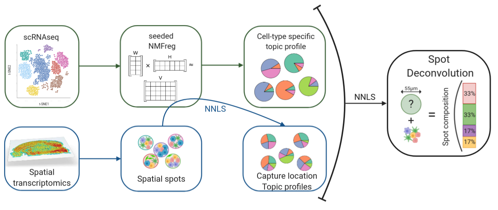

```{r, include = FALSE}
knitr::opts_chunk$set(
  collapse = TRUE,
  comment = "#>",
  fig.path = "man/figures/README-",
  out.width = "100%",
  cache = TRUE,
  cache.lazy = FALSE,
  warning = FALSE,
  message = FALSE,
  eval = TRUE
)
```

```{r, out.width = "200px", echo = FALSE, fig.align='center'}

```

The goal of **SPOTlight** is to provide a tool that enables the deconvolution of cell types and cell type proportions present within each capture locations comprising mixtures of cells, originally developed for 10X's Visium - spatial trancsiptomics- technology, it can be used for all technologies returning mixtures of cells. **SPOTlight** is based on finding topic profile signatures, by means of an NMFreg  model, for each cell type and finding which combination fits best the spot we want to deconvolute.




## Installation

You can install the latest stable version from the GitHub repository [SPOTlight](https://github.com/MarcElosua/SPOTlight) with:
```{r eval = FALSE}
# install.packages("devtools")
devtools::install_github("https://github.com/MarcElosua/SPOTlight")
```

Or the latest version in development by downloading the devel branch
```{r eval = FALSE}
devtools::install_github("https://github.com/MarcElosua/SPOTlight", ref = "devel")
```

To ensure the environment is compatible we have put out a docker environmnet that can be downloaded from DockerHub. \
To download the R environment image
```
# R environment
docker pull marcelosua/spotlight_env_r:latest
```

To download the R studio image
```
# Rstudio environment
docker pull marcelosua/spotlight_env_rstudio:latest
```
Run the following command in the terminal
```
docker run -e PASSWORD=pwd -p 8787:8787 marcelosua/spotlight_env_rstudio 
```
Go to **http://localhost:8787/** or other port you've set before.

Log in with:

**username**: rstudio

**password**: pwd # Same password as set in the above command (pwd)

In the Rstudio environment you can upload files and carry out analysis there, to save the files from the RStudio server click on More (gear) and export the desired files.

For more information check out the [rocker](https://www.rocker-project.org/) project guidelines https://hub.docker.com/r/rocker/rstudio/ 

## Tutorial

In this basic tutorial we show how the tool works step by step and some of the utilities it has.
```{r warning = FALSE, message = FALSE}
library(SPOTlight)
library(Seurat)
library(dplyr)
# devtools::install_github('satijalab/seurat-data')
library(SeuratData)
```

### Mouse brain Dataset
For the purpose of this tutorial we are going to use adult mouse brain data. The scRNAseq data can be downloaded [here](), while the spatial data is the one put out publicly by [10X](https://www.10xgenomics.com/resources/datasets/) and the processed object can be downloaded [here](PENDING).

#### scRNAseq
```{r}
# This file loads single cell experiment objects
cortex_sc <- readRDS("sample_data/allen_cortex_dwn.rds")
```

```{r}
cortex_sc <- Seurat::SCTransform(cortex_sc, verbose = FALSE)

cortex_sc <- Seurat::RunPCA(cortex_sc, verbose = FALSE)
cortex_sc <- Seurat::RunUMAP(cortex_sc, dims = 1:30, verbose = FALSE)

cortex_sc <- Seurat::FindNeighbors(cortex_sc, dims = 1:30, verbose = FALSE)
cortex_sc <- Seurat::FindClusters(cortex_sc, verbose = FALSE)
```

##### Spatial data
```{r}
# InstallData("stxBrain")
anterior <- LoadData("stxBrain", type = "anterior1")
```

```{r}
anterior <- Seurat::SCTransform(anterior, assay = "Spatial", verbose = FALSE)

anterior <- Seurat::RunPCA(anterior, verbose = FALSE)
anterior <- Seurat::RunUMAP(anterior, dims = 1:30, verbose = FALSE)

anterior <- Seurat::FindNeighbors(anterior, dims = 1:30, verbose = FALSE)
anterior <- Seurat::FindClusters(anterior, verbose = FALSE)
```

### Data visualization
```{r}
Seurat::DimPlot(cortex_sc, group.by = "subclass")
Seurat::SpatialDimPlot(anterior)
```

### Deconvolution
#### Get marker genes
If the dataset is very large we want to downsample it, both in of number of cells and number of genes, to train the model. To do this downsampling we want to keep a representative amount of cells per cluster and the most important genes. We show that this downsampling doesn't affect the performance of the model and greatly speeds up the model training.

To determine the most important genes we can use the function `Seurat::FindAllMarkers` which will return the markers for each cluster.

We can set the following parameters for more specific markers:

- **assay** = "SCT" + **slot** = "data" - we want to select the markers out of ALL the possible genes no only from the most highly variable ones.

- **only.pos** = TRUE - we are only interested in those genes specifically expressed in that cluster.

- **min.pct = 0.9** - we are interested in genes present in all the cells from that cell type.

```{r eval = FALSE}
#### Extract the top marker genes from each cluster ####
Seurat::Idents(object = cortex_sc) <- cortex_sc@meta.data$subclass
cluster_markers_all <- Seurat::FindAllMarkers(object = cortex_sc, 
                                              assay = "SCT",
                                              slot = "data",
                                              verbose = TRUE, 
                                              only.pos = TRUE, 
                                              logfc.threshold = 1,
                                              min.pct = 0.9)

saveRDS(object = cluster_markers_all,
        file = "sample_data/markers_anterior.RDS")
```

```{r}
cluster_markers_all <- readRDS("sample_data/markers_anterior.RDS")
```

#### Run deconvolution
To run the deconvolution, one just needs to run the following function.

For the sake of speed we will 10 cells per cell-type, we found the optimal number to be ~100
```{r eval = FALSE}
set.seed(123)
spotlight_ls <- spotlight_deconvolution(se_sc = cortex_sc,
                                        counts_spatial = anterior@assays$Spatial@counts,
                                        clust_vr = "subclass",
                                        cluster_markers = cluster_markers_all,
                                        cl_n = 50,
                                        hvg = 3000,
                                        ntop = NULL,
                                        transf = "uv",
                                        method = "nsNMF",
                                        min_cont = 0.09)

saveRDS(object = spotlight_ls,
        file = "sample_data/spotlight_ls_anterior.RDS")
```

Load deconvolution matrix directly
```{r}
spotlight_ls <- readRDS(file = "sample_data/spotlight_ls_anterior.RDS")
decon_mtrx <- spotlight_ls[[2]]
cell_types_all <- colnames(decon_mtrx)[which(colnames(decon_mtrx) != "res_ss")]
```

### Visualization
#### Spatial scatterpie plot
We can visualize the composition of all the spots on the tissue.
1st add the spot composition to the metadata matrix:
```{r}
anterior@meta.data <- cbind(anterior@meta.data, decon_mtrx)
```

2nd Plot spot composition of all the cell types
```{r}
SPOTlight::spatial_scatterpie(se_obj = anterior,
                              cell_types_all = cell_types_all,
                              img_path = "sample_data/spatial/tissue_lowres_image.png")
```

3rd show only spots containing cell types of interest
```{r}
SPOTlight::spatial_scatterpie(se_obj = anterior,
                              cell_types_all = cell_types_all,
                              img_path = "sample_data/spatial/tissue_lowres_image.png",
                              cell_types_interest = "L6b")
```

#### Spatial location
We can take a look at how the cell types are predicted to be spatially distributed.
```{r}
SpatialFeaturePlot(anterior,
                 features = "L6b", 
                 pt.size.factor = 1,
                 alpha = c(0, 1)) +
  ggplot2::scale_fill_gradientn(
      colours = heat.colors(10, rev = TRUE),
      limits = c(0, 1))
```

#### Spatial interaction graph
Now that we know which cell types are found within each spot we can make a graph representing spatial interactions where cell types will have stronger edges between them the more often we find them within the same spot. To do this we will only need to run the function `get_spatial_interaction_graph`, this function prints the plot and returns the elements needed to plot it.
```{r}
graph_ntw <- get_spatial_interaction_graph(decon_mtrx = decon_mtrx[, cell_types_all])
```

If you want to tune how the graph looks you can do the following or you can check out more options [here](https://www.r-graph-gallery.com/network.html):
```{r}
library(igraph)
library(RColorBrewer)
deg <- degree(graph_ntw, mode="all")

# Get color palette for difusion
edge_importance <- E(graph_ntw)$importance

# Select a continuous palette
qual_col_pals <- brewer.pal.info[brewer.pal.info$category == 'seq',]

# Create a color palette
getPalette <- colorRampPalette(brewer.pal(9, "YlOrRd"))

# Get how many values we need
grad_edge <- seq(0, max(edge_importance), 0.1)

# Generate extended gradient palette dataframe
graph_col_df <- data.frame(value = as.character(grad_edge),
                           color = getPalette(length(grad_edge)),
                           stringsAsFactors = FALSE)
# Assign color to each edge
color_edge <- data.frame(value = as.character(round(edge_importance, 1)), stringsAsFactors = FALSE) %>%
  dplyr::left_join(graph_col_df, by = "value") %>%
  dplyr::pull(color)

# Open a pdf file
plot(graph_ntw,
     # Size of the edge
     edge.width = edge_importance,
     edge.color = color_edge,
     # Size of the buble
     vertex.size = deg,
     vertex.color = "#cde394",
     vertex.frame.color = "white",
     vertex.label.color = "black",
     vertex.label.family = "Ubuntu", # Font family of the label (e.g.“Times”, “Helvetica”)
     layout = layout.circle)
```

#### Look at cell type profiles
We can take a look at the cell-type specific topic profiles and assess their uniqueness, if two cells have similar profiles they may be confounded.
```{r}
nmf_mod_ls <- spotlight_ls[[1]]
nmf_mod <- nmf_mod_ls[[1]]
```

Plot topic profiles
```{r}
h <- NMF::coef(nmf_mod)
rownames(h) <- paste("Topic", 1:nrow(h), sep = "_")
topic_profile_plts <- dot_plot_profiles_fun(h = h,
                      train_cell_clust = nmf_mod_ls[[2]], 
                      clust_vr = "subclass")
topic_profile_plts[[2]] + theme(axis.text.x = element_text(angle = 90), 
                                axis.text = element_text(size = 12))
```

```{r, include = FALSE}
knitr::opts_chunk$set(eval = FALSE)
```

## Step-by-Step insight
Here we are going to show step by step what is going on and all the different steps involved in the process.

```{r, out.width = "800px", echo = FALSE, fig.align='center'}
knitr::include_graphics("img/SPOTlight_scheme.pdf")
```

#### Downsample data
If the dataset is very large we want to downsample it, both in terms of number of cells and number of genes, to train the model. To do this downsampling we want to keep a representative amount of cells per cluster and the most important genes. We show that this downsampling doesn't affect the performance of the model and greatly speeds up the model training.
```{r eval = FALSE}
# Downsample scRNAseq to select gene set and number of cells to train the model
se_sc_down <- downsample_se_obj(se_obj = cortex_sc,
                                clust_vr = "subclass",
                                cluster_markers = cluster_markers_all,
                                cl_n = 100,
                                hvg = 3000)

```

#### Train NMF model
Once we have the data ready to pass to the model we can train it as shown below.
```{r eval = FALSE}
start_time <- Sys.time()
nmf_mod_ls <- train_nmf(cluster_markers = cluster_markers_all, 
                        se_sc = se_sc_down, 
                        mtrx_spatial = anterior@assays$Spatial@counts, 
                        clust_vr = "subclass",
                        ntop = NULL,
                        hvg = 3000,
                        transf = "uv",
                        method = "nsNMF",
                        min_cont = 0.09)

nmf_mod <- nmf_mod_ls[[1]]
```

Extract matrices form the model:
```{r eval = FALSE}
# get basis matrix W
w <- basis(nmf_mod)
dim(w)

# get coefficient matrix H
h <- coef(nmf_mod)
dim(h)
```

Look at cell-type specific topic profile
```{r eval = FALSE}
rownames(h) <- paste("Topic", 1:nrow(h), sep = "_")
topic_profile_plts <- dot_plot_profiles_fun(h = h,
                      train_cell_clust = nmf_mod_ls[[2]], 
                      clust_vr = clust_vr)
topic_profile_plts[[2]] + theme(axis.text.x = element_text(angle = 90))
```

#### Spot Deconvolution
```{r eval = FALSE}
# Extract count matrix
spot_counts <- anterior@assays$Spatial@counts

# Subset to genes used to train the model
spot_counts <- spot_counts[rownames(spot_counts) %in% rownames(w), ]
```

Run spots through the basis to get the pertinent coefficients. To do this for every spot we are going to set up a system of linear equations where we need to find the coefficient, we will use non-negative least squares to determine the best coefficient fit. 
```{r eval = FALSE}
ct_topic_profiles <- topic_profile_per_cluster_nmf(h = h,
                              train_cell_clust = nmf_mod_ls[[2]],
                              clust_vr = clust_vr)

decon_mtrx <- mixture_deconvolution_nmf(nmf_mod = nmf_mod,
                          mixture_transcriptome = spot_counts,
                          transf = transf,
                          reference_profiles = ct_topic_profiles, 
                          min_cont = 0.09)
````

