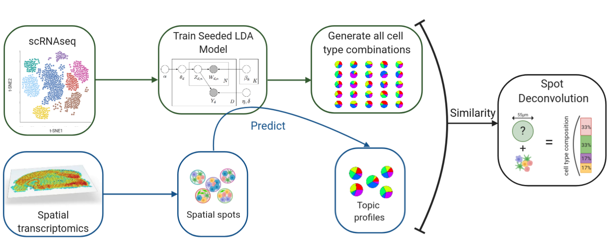

<!-- README.md is generated from README.Rmd. Please edit that file -->

```{r, include = FALSE}
knitr::opts_chunk$set(
  collapse = TRUE,
  comment = "#>",
  fig.path = "man/figures/README-",
  out.width = "100%",
  cache = TRUE
)
```

# SpatialDeconTest

```{r echo = FALSE, eval=FALSE, message=FALSE}
# <!-- badges: start -->
# <!-- [](https://travis-ci.org/MarcElosua/SpatialDeconTest) -->
# <!-- [](https://ci.appveyor.com/project/MarcElosua/SpatialDeconTest) -->
# <!-- [](https://codecov.io/gh/MarcElosua/SpatialDeconTest?branch=master) -->
# <!-- badges: end -->
```

The goal of SpatialDeconTest is to provide a tool that enables the deconvolution of cell types and cell type proportions present within each spot obtained from 10X's visium - spatial trancsiptomics- technology. 



## Installation

You can install the latest version from the GitHub repository [SpatialDeconTest](https://github.com/MarcElosua/SpatialDeconTest) with:

``` r
# install.packages("devtools")
devtools::install_github("https://github.com/MarcElosua/SpatialDeconTest")
```

## Tutorial

This is a basic example on a simple dataset to illustrate how to run the workflow:

```{r warning=FALSE, message=FALSE}
library(org.Hs.eg.db)
library(SpatialDeconTest)
```

```{r parameters}
tech <- '10x'
dwn_smplng <- 'none'
tissue <- 'mixology'

source('misc/paths_vrs.R')
# source('utils/bin.r')
```

## Single Cell Mixology
In this step by step analysis we will assess how the deconvolution performs on the single cell mixology data generate by Matthew E. Ritchie in his paper [Benchmarking single cell RNA-sequencing analysis pipelines using mixture control experiments](https://www.ncbi.nlm.nih.gov/pubmed/31133762). All data can be accessed in this [sc_mixology github repository](https://github.com/LuyiTian/sc_mixology). It uses 5 different cell types for the scRNAseq: human lung adenocarcinoma cell lines HCC827, H1975, H2228, H838, and A549. To do the mixed spots it only uses the first 3 (HCC827, H1975, H2228) to do 9 cell combinations.

We are going to use this data since it is put out to carry out benchmarking experiments and is a good controled way of knowing wich combination of 9-cells is in each mixture. 

### Loading the data
```{r}
# load('data/mixture_data/9cellmix_qc.RData') # This file loads single cell experiment objects
load(url('https://github.com/LuyiTian/sc_mixology/raw/master/data/9cellmix_qc.RData'))
# sce_9cells_qc;sce_POP_sel_qc;sce_SC1_qc;sce_SC2_qc;sce_SC3_qc;sce_SC4_qc 

# load('data/mixture_data/sincell_with_class_5cl.RData') # This file loads single cell experiment objects
load(url('https://github.com/LuyiTian/sc_mixology/raw/master/data/sincell_with_class_5cl.RData'))
# sc_Celseq2_5cl_p1;sc_Celseq2_5cl_p2;sc_Celseq2_5cl_p3;sce_sc_10x_5cl_qc
# All this files are single cell
```

To train the model we will use the 10x data from the file sincell_with_class_5cl.RData. We will first run some QC tests to assess the quality. The first step will be to convert it to a Seurat object.
```{r}
se_sc_10x_5cl_qc <- Seurat::CreateSeuratObject(counts = sce_sc_10x_5cl_qc@assays$data$counts,
                                               project = '10x_mixology', 
                                               assay = 'RNA', 
                                               meta.data = data.frame(colData(sce_sc_10x_5cl_qc)))

```

### Downsampling + Data preprocessing
If the dataset is very large we want to downsample it, both in terms of number of cells and number of genes, to train the model. To do this downsampling we want to keep a representative amount of cells per cluster and the most important genes.
We will select first the genes of interest, to do so we will grab each cluster's markers plus the 5000 most variable genes.  
We can extract the top marker genes from each cluster and select the unique ones to use as seeds for the model
```{r}
se_sc_10x_5cl_qc <- se_sc_10x_5cl_qc[,se_sc_10x_5cl_qc$cell_line_demuxlet %in% c("HCC827","H1975","H2228")]

#### Extract the top marker genes from each cluster ####
Idents(object = se_sc_10x_5cl_qc) <- se_sc_10x_5cl_qc$cell_line_demuxlet
cluster_markers_all <- Seurat::FindAllMarkers(object = se_sc_10x_5cl_qc, verbose = TRUE, only.pos = T)

se_sc_10x_5cl_qc <- downsample_se_obj(se_obj = se_sc_10x_5cl_qc, clust_vr = 'cell_line_demuxlet', cluster_markers_all = cluster_markers_all)
# saveRDS(object = se_sc_10x_5cl_qc,file = 'se_sc_10x_5cl_qc.RDS')
# se_sc_10x_5cl_qc <- readRDS(file = 'se_sc_10x_5cl_qc.RDS')

```

### Train LDA model
Once we have the data ready to pass to the model we can train it as shown below. For larger and more complex datasets ~8000 gibbs iterations are recommended. If more iterations are needed you can always resume where you left off and run more iterations on the previosuly trained model.
```{r}
#### Train LDA model ####
set.seed(1)
lda_mod_ls <- train_lda(se_obj = se_sc_10x_5cl_qc, clust_vr = 'cell_line_demuxlet', cluster_markers_all = cluster_markers_all, al = 0.01, verbose = 50, iter = 300, burnin = 100, best = TRUE, keep = 1, nstart = 1)

# Select the best model
lda_mod <- lda_mod_ls[[1]]
# saveRDS(object = lda_mod,file = 'lda_mod.RDS')
# lda_mod <- readRDS(file = 'lda_mod.RDS')

```

### Spot Deconvolution
Create all posible combinations between 3-8 cells per spot.
We get the cell composition and the topic profile por each combination. We will compare the topic profiles of all these synthetic spots with the predicted topic profiles obtained from running the spatial spots through the LDA model.  The prediction process can be parallelized to speed it up.

Mixed spots representing the grount truth are obtained from the sce_9cells_qc object where all possible combinations of HCC827, H1975, H2228 were carried out.
```{r}
# Extract count matrix
spot_counts <- Matrix(sce_9cells_qc@assays$data$counts,sparse = T)
ens_genes <- rownames(spot_counts)

# Convert Ensembl ids to symbols
# library(org.Hs.eg.db)
symb_genes <- mapIds(x = org.Hs.eg.db, keys = ens_genes, column = 'SYMBOL', keytype = 'ENSEMBL')
rownames(spot_counts) <- symb_genes

# Subset to genes used to train the model
spot_counts <- spot_counts[rownames(spot_counts) %in% lda_mod@terms, ]

# Transpose spot_counts so its SPOTxGENES
spot_counts <- BiocGenerics::t(spot_counts)

decon_mtrx <- spot_deconvolution(lda_mod = lda_mod, se_obj = se_sc_10x_5cl_qc, 
                                     clust_vr = 'cell_line_demuxlet',  spot_counts = spot_counts, 
                                     verbose = TRUE, ncores = 5, parallelize = TRUE,
                                     top_dist = 155, top_JSD = 1)

# lda_mod = lda_mod; se_obj = se_sc_10x_5cl_qc; clust_vr = 'cell_line_demuxlet';  spot_counts = spot_counts; verbose = TRUE;
# ncores = 5; parallelize = TRUE; top_dist = 1000; top_JSD = 15
```

### BONUS - Benchmark with synthetic test spots
Furthermore, we can test the performance of the model on synthetically generated test spots to get a sense on how well the model will perform on your data.

First of all we can check if the model has achieved an optimal solution by checking if the maximum-likelyhood has plateaud.
```{r}
library(ggplot2)
data.frame(lda_mod@logLiks) %>% 
  rowid_to_column('rowid') %>% 
  ggplot2::ggplot() + 
    geom_point(aes(x = rowid, y=lda_mod@logLiks), alpha = 0.6, col = 'blue') +
    theme_classic()
```


If the model hasn't plateaud or has plateaud below the best model with the set number of iterations we can run more iterations on the model right where we left off. We can change the nstart parameter which will run the model at 3 different stochastic start points to try to find a better local minima.
```{r eval = FALSE}
# Prepare count matrix to pass to the model
se_lda_ready <- prep_seobj_topic_fun(se_obj = se_sc_10x_5cl_qc)

# Set parameters
control_LDA_Gibbs <- list(alpha = 0.01, verbose = 1, keep = 1,
                          seed = round(runif(3,0,1000),0), nstart = 3, best = TRUE,
                          iter = 300, burnin = 100)

# Train model
s_gibbs_seed <- Sys.time()
print(s_gibbs_seed)
set.seed(1234)
lda_mod <- LDA(se_lda_ready, k=k, model = lda_mod,
               method='Gibbs', # Seedwords are only available with Gibbs sampling
               control=control_LDA_Gibbs)
print(sprintf('LDA seeded took: %s', difftime(Sys.time(), s_gibbs_seed, units = 'mins'))) # Takes ~10min

```

If the model had already reached a local minima or we have reached it by re-training the model we can assess its performance with synthetically generated test spots. We can generate test spots with the function *test_spot_fun()* below. 
```{r}
test_spots_ls <- test_spot_fun(se_obj=se_sc_10x_5cl_qc, clust_vr = 'cell_line_demuxlet', n=1000, verbose=TRUE)
test_spots_counts <- test_spots_ls[[1]]
test_spots_metadata <- test_spots_ls[[2]]
test_spots_metadata <- as.matrix(test_spots_metadata[,which(colnames(test_spots_metadata) != 'name')])
```

We then predict the topic profiles of these synthetic generated spots
```{r}
decon_mtrx <- spot_deconvolution(lda_mod = lda_mod, se_obj = se_sc_10x_5cl_qc,
                                     clust_vr = 'cell_line_demuxlet',  spot_counts = test_spots_counts, 
                                     verbose = TRUE, ncores = 5, parallelize = TRUE,
                                     top_dist = 100, top_JSD = 15)
```

Lastly, we can assess its performance with the function *test_synthetic_performance()*
```{r}
raw_statistics_ls <- test_synthetic_performance(test_spots_metadata_mtrx = test_spots_metadata, 
                                             spot_composition_mtrx = decon_mtrx)
raw_statistics_ls
```


## Step-by-step workflow
If you want to understand a bit better what is going on in the previous step here is the workflow executed step-by-step. All the above steps are to show how the workflow works and make it available and understandable.

Normalizing and Transform the data, dimensionality reduction and clusters assignment.
```{r eval = FALSE}
se_sc_10x_5cl_qc <- SCTransform(se_sc_10x_5cl_qc, vars.to.regress = "percent.mt", verbose = T,variable.features.n = 5000)
se_sc_10x_5cl_qc <- FindVariableFeatures(object = se_sc_10x_5cl_qc, nfeatures = 5000)

se_sc_10x_5cl_qc <- RunPCA(se_sc_10x_5cl_qc, verbose = FALSE)
se_sc_10x_5cl_qc <- RunUMAP(se_sc_10x_5cl_qc, dims = 1:30, verbose = FALSE)

se_sc_10x_5cl_qc <- FindNeighbors(se_sc_10x_5cl_qc, dims = 1:30, verbose = FALSE)
se_sc_10x_5cl_qc <- FindClusters(se_sc_10x_5cl_qc, verbose = FALSE)
```

1st standard viz
```{r eval = FALSE}
se_sc_10x_5cl_qc$percent.mt <- 1-se_sc_10x_5cl_qc$non_mt_percent

count_thresh <- log10(750)
gene_thresh <- 250
mt_thresh <- 0.30
vrs_names <- c('nCount_RNA', 'nFeature_RNA', 'percent.mt')

# Running plots
QC_plots1 <- QC_plots_fun(
  se_obj = se_sc_10x_5cl_qc,
  count_thresh = count_thresh,
  gene_thresh = gene_thresh,
  mt_thresh = mt_thresh,
  vrs_names = vrs_names)

QC_plots2 <- QC_UMAP_fun(
  se_obj = se_sc_10x_5cl_qc,
  vrs_names = vrs_names
)

top_row <- ggpubr::ggarrange(plotlist = list(QC_plots1[[1]], QC_plots1[[2]], QC_plots1[[3]]), ncol = 3, align = 'hv')
bot_row <- ggpubr::ggarrange(plotlist = list(QC_plots1[[4]], QC_plots2), ncol = 2, align = 'hv')
QC_plts <- ggpubr::ggarrange(plotlist = list(top_row, bot_row),
                             nrow = 2, align = 'hv')
QC_plts
```


From the QC plots we can see that library size, number of detected genes and mitochondrial gene proportion follow a normal distribution with not much skewness. Furthermore the mitochondrial proportion does not show a correlatino with the number of detected genes so we wont regress out the effect ot mitochondrial proportion. No obvious low quality cells remain in this dataset so we won't exclude any further ones.

Looking at the clustering we can clearly see that the cells cluster by cell line.
```{r eval = FALSE}
DimPlot(se_sc_10x_5cl_qc, reduction = 'pca', group.by = 'cell_line')
DimPlot(se_sc_10x_5cl_qc, reduction = 'pca', group.by = 'cell_line_demuxlet')

DimPlot(se_sc_10x_5cl_qc, reduction = 'umap', group.by = 'cell_line')
DimPlot(se_sc_10x_5cl_qc, reduction = 'umap', group.by = 'cell_line_demuxlet')
DimPlot(se_sc_10x_5cl_qc, reduction = 'umap', group.by = 'seurat_clusters', label = T)
```


If we take a look at cell cycle genes to see if we need to correct by it we see that the cells are pretty synchronized. Since it is always better to not over-correct the data we won't regress out the cell cycle.
```{r eval = FALSE}
FeaturePlot(se_sc_10x_5cl_qc,features = c('MYC','CDT1','CDC25A','CDC25B','CDC25C','CCND1'))
# Cdt1 accumulates in G1 and is degraded in S
# CDC25A/B/C - DNA markers are good markers to study the G1/S phase.
# CCND1 (Cyclin D1) is required for G1/S cell cycle transition and can also be used as a G2/M checkpoint marker
```


## Downsampling dataset
If the dataset is very large we want to downsample it, both in terms of number of cells and number of genes, to train the model. To do this downsampling we want to keep a representative amount of cells per cluster and the most important genes.
We will select first the genes of interest, to do so we will grab each cluster's markers plus the 5000 most variable genes.  
We can extract the top marker genes from each cluster and select the unique ones to use as seeds for the model

Select only the 3 cell types used in the mixed spots
```{r eval = FALSE}
se_sc_10x_5cl_qc <- se_sc_10x_5cl_qc[,se_sc_10x_5cl_qc$cell_line_demuxlet %in% c("HCC827","H1975","H2228")]
```

```{r eval = FALSE}
Idents(object = se_sc_10x_5cl_qc) <- se_sc_10x_5cl_qc$cell_line_demuxlet
cluster_markers_all <- Seurat::FindAllMarkers(object = se_sc_10x_5cl_qc, verbose = TRUE, only.pos = T)
# saveRDS(object = cluster_markers_all,file = sprintf('%s/%s/cluster_markers_all_%s.RDS', an_01, robj_dir, ver))
# cluster_markers_all <- readRDS(file = sprintf('%s/%s/cluster_markers_all_%s.RDS', an_01, robj_dir, ver))
```

Combine marker genes and highest variable genes and subset genes
```{r eval = FALSE}
keep_genes <- unique(c(VariableFeatures(se_sc_10x_5cl_qc), cluster_markers_all$gene))
```

Get cell IDs to subset by cluster
```{r eval = FALSE}
keep_ids <- lapply(split(se_sc_10x_5cl_qc@meta.data, se_sc_10x_5cl_qc@meta.data$seurat_clusters), function(subdf){
  # Determine n_sample, if the size of the group is < 100 use all the group, if not just use 100
  n_sample <- if_else(nrow(subdf) < 100, nrow(subdf), 100L)
  # Subset a random selection of that group and get the identifiers
  tmp_ds <- subdf[sample(1:nrow(subdf), n_sample),] %>% 
    rownames_to_column('ID') %>%
    dplyr::pull(ID)
  return(tmp_ds)
}) %>%
  purrr::flatten_chr() # flatten the list into a vector
```

Subset seurat object
```{r eval = FALSE}
se_sc_10x_5cl_qc <- se_sc_10x_5cl_qc[keep_genes,keep_ids]
```

## Train model
We will set some parameters the we will use to train the model. K is the numer of topics which we will assume to be the same as the number of clusters found by Seurat. With droplevels we make sure that there are no levels defined with no representation
```{r eval = FALSE}
k <- nlevels(droplevels(factor(se_sc_10x_5cl_qc$cell_line_demuxlet)))
nfeatures <- nrow(se_sc_10x_5cl_qc)
```

We then will get the dataset ready to pass to the LDA model
```{r eval = FALSE}
se_lda_ready <- prep_seobj_topic_fun(se_obj = se_sc_10x_5cl_qc)
```

Select up to top 100 marker genes for each cluster
```{r eval = FALSE}
cluster_markers <- cut_markers2(markers = cluster_markers_all, ntop = 100L)
```

Select unique markers from each cluster, if there are common markers between clusters lda model gets confused and classifies very different clusters as belonging to the same topic just because the seeding induced it!
```{r eval = FALSE}
cluster_markers_uniq <- lapply(unique(cluster_markers$cluster), function(clust){
  ls1 <- cluster_markers[cluster_markers$cluster == clust,'gene']
  ls2 <- cluster_markers[cluster_markers$cluster != clust,'gene']
  ls1_unique <- ls1[!ls1 %in% ls2]
  
  return(cluster_markers[cluster_markers$cluster == clust & cluster_markers$gene %in% ls1_unique,])
}) %>% 
  bind_rows()

```

Set seedwords from top markers. Here we are setting the weights for each topic, the words that are weighted positively are those belonging to the list of top markers for a cluster. In the seedgenes matrix each row represents a topic and each column represents a gene. To the LDA model we need to pass a matrix with k rows and ngene columns, where each cell has the weight of that gene for that topic. The weight we're assigning is the logFC 
```{r eval = FALSE}
# initialize matrix
seedgenes <- matrix(nrow=k, ncol=ncol(se_lda_ready), data=0)
colnames(seedgenes) = colnames(se_lda_ready)

for (i in 1:k) { seedgenes[i,cluster_markers_uniq[cluster_markers_uniq$cluster == cluster_markers_uniq$cluster[[i]],'gene']] = cluster_markers_uniq[cluster_markers_uniq$cluster == cluster_markers_uniq$cluster[[i]],'logFC_z']; print(i) }

# Verify that weights have been added
table(seedgenes != 0)

```

### LDA model
```{r eval = FALSE}
# Set parameters
control_LDA_Gibbs <- list(alpha = al, estimate.beta = TRUE,
                          verbose = 1, keep = 1,
                          seed = as.integer(Sys.time()), nstart = 1, best = T,
                          iter = 300, burnin = 100)

# Train model
s_gibbs_seed <- Sys.time()
print(sprintf('Starting to train LDA model at %s. No output is returned during training, please wait.',s_gibbs_seed))
set.seed(123)
lda_mod <- LDA(se_lda_ready, k=k,
                   method='Gibbs', seedwords=seedgenes, # Seedwords are only available with Gibbs sampling
                   control=control_LDA_Gibbs)
print(sprintf('LDA seeded took: %s', difftime(Sys.time(), s_gibbs_seed, units = 'mins'))) # Takes ~10min
saveRDS(lda_mod, file = sprintf('%s/seeded_lda_%s_%s_%s.RDS', robj_dir, al, ver, id_comp))
print(sprintf('%s/seeded_lda_%s_%s_%s.RDS', robj_dir, al, ver, id_comp))

lda_mod <- lda_mod_ls[[1]]
```

### Predict topic profiles
Mixed spots representing the grount truth are obtained from the sce_9cells_qc object where all possible combinations of HCC827, H1975, H2228 were carried out.
```{r  eval  = FALSE}
# Extract count matrix
spot_counts <- Matrix(sce_9cells_qc@assays$data$counts,sparse = T)
ens_genes <- rownames(spot_counts)

# Convert Ensembl ids to symbols
# library(org.Hs.eg.db)
symb_genes <- mapIds(x = org.Hs.eg.db, keys = ens_genes, column = 'SYMBOL', keytype = 'ENSEMBL')
rownames(spot_counts) <- symb_genes

# Subset to genes used to train the model
spot_counts <- spot_counts[rownames(spot_counts) %in% lda_mod@terms, ]

# Transpose spot_counts so its SPOTxGENES
spot_counts <- BiocGenerics::t(spot_counts)
```

Now to predict the topic profiles of the mixed spots...
```{r eval  = FALSE}
# Set up cluster to parallelize
# Detect number of cores and use 60% of them
ncores <- round(parallel::detectCores() * 0.60)
# Set up the backend
cl <- parallel::makeCluster(ncores)
# Register the backend
doSNOW::registerDoSNOW(cl)


pred_start <- Sys.time()
Sys.time()

print('Running predictions')

## Set progress bar ##
iterations <- length(seq(1,nrow(spot_counts),10))
pb <- txtProgressBar(max = iterations, style = 3)
progress <- function(n) setTxtProgressBar(pb, n)
opts <- list(progress = progress)

prediction <- foreach(index=seq(1,nrow(spot_counts),10),
                      .combine = 'rbind',
                      .packages=c('topicmodels','Matrix', 'dplyr'),
                      .options.snow = opts) %dopar% {

  index_end <- dplyr::if_else( (index+9) <= nrow(spot_counts), as.double(index+9), as.double(nrow(spot_counts)))

  test_spots_pred <- topicmodels::posterior(object = lda_mod,
                                            newdata = spot_counts[index:index_end,])
  return(test_spots_pred$topics)

}

parallel::stopCluster(cl)
print(sprintf('Time to predict: %s', round(difftime(Sys.time(), pred_start, units = 'mins')),2))
```


### Generate all posible synthetic spots
Below we generate all the possible spot combinations containing between 2-8 cells since we aproximate that by their size the spots won't have more than ~10 cells
```{r eval = FALSE}
#### Calculate topic profiles for every cluster ####
clust_profiles <- topic_profile_per_cluster(lda_mod = lda_mod, se_obj = se_sc_10x_5cl_qc, clust_vr = clust_vr)
round(clust_profiles,4)

if(class(clust_profiles) != "matrix") clust_profiles <- as.matrix(clust_profiles)

# If a cluster is 0 change it to 1
if(sum(grepl(pattern = "0",rownames(clust_profiles))) != 0){
  rownames(clust_profiles) <- as.character(as.numeric(rownames(clust_profiles))+1)
}

# Compute all possible combinations up to grabbing round(nrow(comb)*0.66)
k_sub <- 8
comb <- combinations(x = c(0:(nrow(clust_profiles))), k = k_sub, replace=TRUE)

# Remove all those combinations that only include 1 or 2 cells
comb <- comb[rowSums(comb != 0) > 2,]


# Create all possible combinations
## Initialize matrix for increased speed so that it doesn't need to create indexes on the fly
tmp_mtrx <- matrix(nrow = nrow(comb), ncol = ncol(clust_profiles))
tmp_metadata <- matrix(nrow = nrow(comb), ncol = nrow(clust_profiles))

print('Creating synthetic spots'); st_syn_spot <- Sys.time()
pb_for <- txtProgressBar(min = 0, max = nrow(comb), style = 3) # Progress bar

for (i in 1:nrow(comb)) {
  # Get how many cells of each type we have
  tt <- table(comb[i,][comb[i,]!=0])
  tmp_metadata[i,as.numeric(names(tt))] <- tt

  # Add all the profiles together
  row_i <- lapply(names(tt), function(nm){
    tmp_vec <- tt[[nm]]*clust_profiles[rownames(clust_profiles)[[as.numeric(nm)]],]
  }) %>% purrr::reduce(.,`+`)

  tmp_mtrx[i,] <- row_i/sum(tt)
  # update progress bar
  setTxtProgressBar(pb_for, i)
}
# rm(list(i,tt,row_i)) # For clean and good practice code, that there are no random tmp variables floating
close(pb_for)
print(sprintf('Creation of %s synthetic spot profiles took: %s minutes',
                          nrow(comb),
                          round(difftime(time1 = Sys.time(),time2 = st_syn_spot,units = 'mins'),2)))

syn_spots_ls <- list(tmp_mtrx,tmp_metadata)

```

### Spot Deconvolution
Create all posible combinations between 3-8 cells per spot.
We get the cell composition and the topic profile por each combination. We will compare the topic profiles of all these synthetic spots with the predicted topic profiles obtained from running the spatial spots through the LDA model.  The prediction process can be parallelized to speed it up.

```{r eval = FALSE}
syn_spots_profiles <- syn_spots_ls[[1]]
syn_spots_metadata <- as.matrix(syn_spots_ls[[2]])
syn_spots_metadata[is.na(syn_spots_metadata)] <- 0

# Calculate all pairwise euclidean distances between the predicted and simulated topic profiles
dist <- pdist(X=prediction,Y=syn_spots_profiles)
dist_mtrx <- as.matrix(dist)

JSD_start <- Sys.time()

# Get list with indices of best euclidean distance for each predictions
JSD_indices <- top_n_predictions(dist_mtrx = dist_mtrx, n = top_dist)

#### Calculate JSD for the subset of best predictions according to Euclidean distance
mtrx_JSD_full <- suppressMessages(calculate_JSD_subset(prediction = prediction, syn_spots_profiles = syn_spots_profiles, JSD_indices = JSD_indices))

quants_JSD <- round(quantile(matrixStats::rowMins(mtrx_JSD_full,na.rm = TRUE),c(0.25,0.5,0.75)),5)
cat(sprintf("Quantiles of the JSD between the best synthetic spot profile and each spot's topic profile are - %s[%s-%s]", quants_JSD[[2]], quants_JSD[[1]], quants_JSD[[3]]))

# Get the index for each list from JSD_indices with the lowest JSD
top_JSD <- if_else(top_JSD <= top_dist, top_JSD, top_dist)

min15_error <- Rfast::rownth(x = mtrx_JSD_full, elems = rep(top_JSD, nrow(mtrx_JSD_full)), na.rm = TRUE)
min_indices_JSD <- lapply(1:length(min15_error), function(i){
  which(mtrx_JSD_full[i,] <= min15_error[i])
})

##### Get Spot composition #####
spot_composition_mtrx <- matrix(nrow = length(min_indices_JSD), ncol = ncol(syn_spots_metadata))
for (i in 1:nrow(spot_composition_mtrx)) {
  spot_composition_mtrx[i,] <- round(colMeans(syn_spots_metadata[JSD_indices[[i]][min_indices_JSD[[i]]],],na.rm = TRUE),0)
}

```

