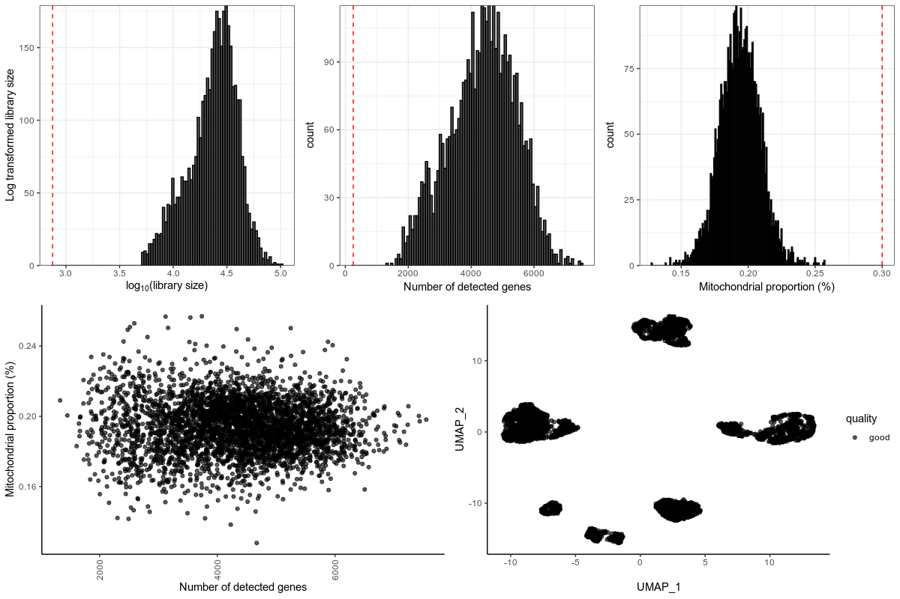
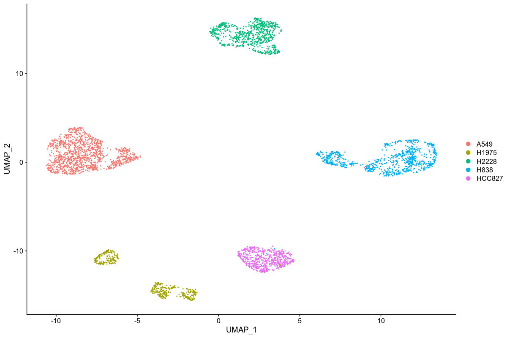
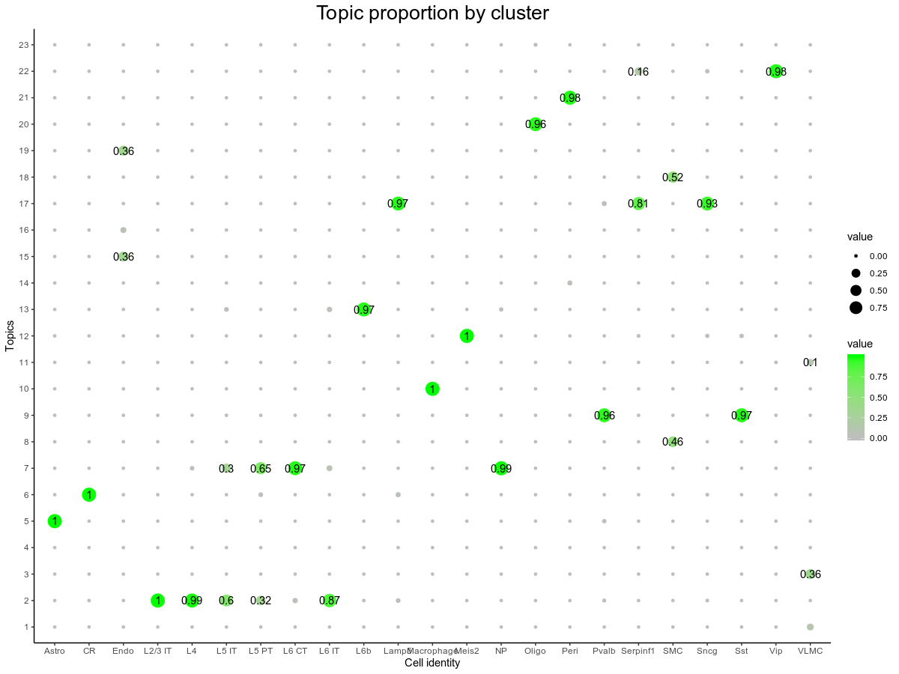
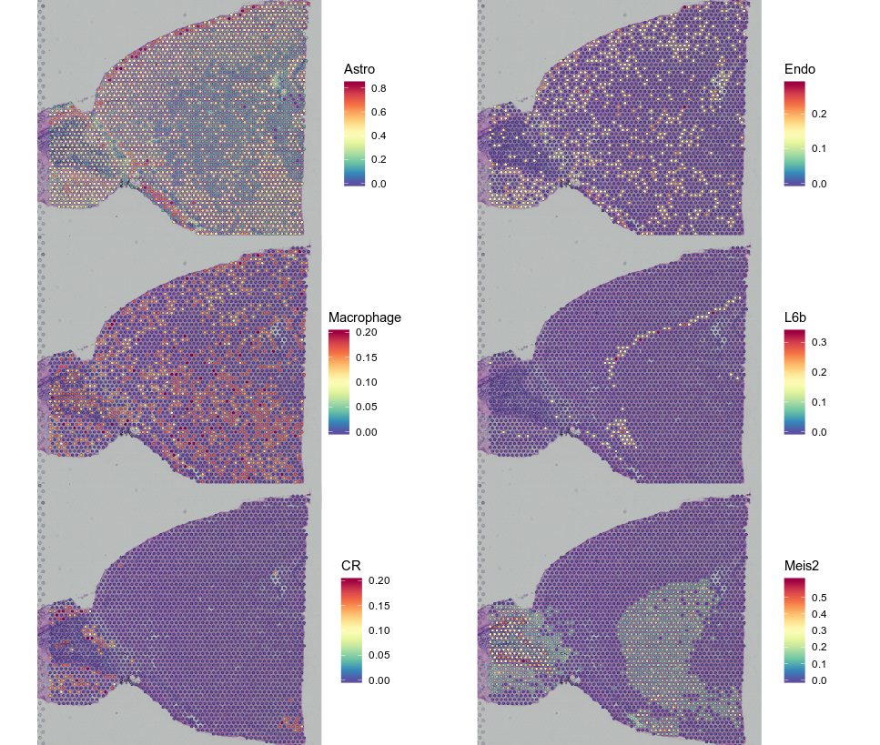

<!-- README.md is generated from README.Rmd. Please edit that file -->
SpatialDeconTest
================

The goal of SpatialDeconTest is to provide a tool that enables the
deconvolution of cell types and cell type proportions present within
each spot obtained from 10X’s visium - spatial trancsiptomics-
technology. It is based on finding topic profile signatures, by means of
a Latent Dirichlet Allocation model, for each cell type and finding
which combination fits best the spot we want to deconvolute.


Installation
------------

You can install the latest version from the GitHub repository
[SpatialDeconTest](https://github.com/MarcElosua/SpatialDeconTest) with:

``` r
# install.packages("devtools")
devtools::install_github("https://github.com/MarcElosua/SpatialDeconTest")
```

Tutorial
--------

This is a basic example on a simple dataset to illustrate how to run the
workflow. In this first section we will show how to run the tool, in the
second we show step-by-step how it works with all the intermediate
steps.

``` r
library(org.Hs.eg.db)
library(SpatialDeconTest)
library(Seurat)
```

### Dataset: Single Cell Mixology

In this step by step analysis we will assess how the deconvolution
performs on the single cell mixology data generate by Matthew E.
Ritchie’s lab in the paper [Benchmarking single cell RNA-sequencing
analysis pipelines using mixture control
experiments](https://www.ncbi.nlm.nih.gov/pubmed/31133762). All data can
be accessed in this [sc\_mixology github
repository](https://github.com/LuyiTian/sc_mixology). It uses 3
different cell types for the scRNAseq: human lung adenocarcinoma cell
lines HCC827, H1975, H2228, H838, and A549. To do the mixed spots it
only uses the first 3 (HCC827, H1975, H2228) to manually do all cell
combinations.

We are going to use this data since it is put out to carry out
benchmarking experiments and is a good controled way of knowing wich
combination of 9-cells is in each mixture.

### Loading the data

``` r
# This file loads single cell experiment objects
load(url("https://github.com/LuyiTian/sc_mixology/raw/master/data/9cellmix_qc.RData"))
# sce_9cells_qc;sce_POP_sel_qc;sce_SC1_qc;sce_SC2_qc;sce_SC3_qc;sce_SC4_qc 

# This file loads single cell experiment objects
load(url("https://github.com/LuyiTian/sc_mixology/raw/master/data/sincell_with_class_5cl.RData"))
# sc_Celseq2_5cl_p1;sc_Celseq2_5cl_p2;sc_Celseq2_5cl_p3;sce_sc_10x_5cl_qc
# All this files are single cell
```

To train the model we will use the 10x data from the file
sincell\_with\_class\_5cl.RData. The first step will be to convert it to
a Seurat object.

``` r
se_sc_10x_5cl_qc <- Seurat::CreateSeuratObject(counts = sce_sc_10x_5cl_qc@assays$data$counts,
                                               project = "10x_mixology", 
                                               assay = "RNA", 
                                               meta.data = data.frame(SingleCellExperiment::colData(sce_sc_10x_5cl_qc)))
```

We scale the gene count data so that we can use it to find cell type
markers.

``` r
se_sc_10x_5cl_qc <- Seurat::ScaleData(se_sc_10x_5cl_qc)
#> Centering and scaling data matrix
```

### Downsampling + Data preprocessing

If the dataset is very large we want to downsample it, both in terms of
number of cells and number of genes, to train the model. To do this
downsampling we want to keep a representative amount of cells per
cluster and the most important genes. We show that this downsampling
doesn’t affect the performance of the model and greatly speeds up the
model training.

To determine the most important genes we can use the function
`Seurat::FindAllMarkers` which will return the markers for each cluster.

Note that we set the following parameters: - **assay** = “RNA” +
**slot** = “scale.data” - we want to select the markers out of ALL the
possible genes no only from the most highly variable ones. -
**only.pos** = TRUE - we are only interested in those genes specifically
expressed in that cluster. - **logfc.threshold** = 1 - we are more
interested in genes that show larger differences with respect to the
rest. - **min.pct** = 0.9 - we want to select markers that are present
in almost all the cells in that cluster.

``` r
se_sc_10x_5cl_qc <- se_sc_10x_5cl_qc[, se_sc_10x_5cl_qc$cell_line_demuxlet %in% c("HCC827", "H1975", "H2228")]

#### Extract the top marker genes from each cluster ####
Seurat::Idents(object = se_sc_10x_5cl_qc) <- se_sc_10x_5cl_qc$cell_line_demuxlet
cluster_markers_all <- Seurat::FindAllMarkers(object = se_sc_10x_5cl_qc, 
                                              assay = "RNA",
                                              slot = "scale.data",
                                              verbose = TRUE, 
                                              only.pos = TRUE, 
                                              logfc.threshold = 1,
                                              min.pct = 0.9)
#> Calculating cluster HCC827
#> Calculating cluster H1975
#> Calculating cluster H2228
```

We extract the top marker genes from each cluster and select the unique
ones to use as seeds for the model. This step is very important, cluster
specific marker genes are key for training the model! We can further
filter the marker genes: - **p\_val\_adj** &lt; 0.01 - we want to make
sure the genes we are using are trully differentially expressed. -
\[**avg\_logFC**\|**avg\_diff**\] &gt; 1 - redundant with
logfc.threshold = 1. - **pct.1** &gt;= 0.9 - min.pct in `FindAllMarkers`
selects for both pct.1 and pct.2 but we are interested in genes present
in almost all the cells from that cluster.

``` r
#### Subset relevant genes ####
# We will only consider those genes with an adjusted p value < 0.01 and an avg_logFC > 1
cluster_markers_all <- cluster_markers_all %>%
  filter(p_val_adj < 0.01 & avg_diff > 1 & pct.1 >= 0.9)
```

Lastly we downsample the genes and number of cells of interest. For
genes we will grab each cluster’s markers as passed in
cluster\_markers\_all plus the 3000 most variable genes. The number of
cells per cluster is set to 10 by default, performance is unchanged if
we increase it and selecting more cells can increase the running time of
the model.

``` r
se_sc_10x_5cl_qc <- downsample_se_obj(se_obj = se_sc_10x_5cl_qc, 
                                      clust_vr = 'cell_line_demuxlet', 
                                      cluster_markers_all = cluster_markers_all,
                                      cl_n = 10)
# saveRDS(object = se_sc_10x_5cl_qc,file = 'se_sc_10x_5cl_qc.RDS')
# se_sc_10x_5cl_qc <- readRDS(file = 'se_sc_10x_5cl_qc.RDS')
```

### Train LDA model

Once we have the data ready to pass to the model we can train it as
shown below. For larger and more complex datasets more gibbs iterations
are recommended. If more iterations are needed you can always resume
where you left off and run more iterations on the previosuly trained
model.

``` r
#### Train LDA model ####
set.seed(123)
lda_mod_ls <- train_lda(se_obj = se_sc_10x_5cl_qc, clust_vr = "cell_line_demuxlet", 
                        cluster_markers_all = cluster_markers_all, al = 0.01, 
                        verbose = 100, iter = 500, burnin = 0,
                        best = TRUE, keep = 10, nstart = 5)
#> [1] "2020-02-14 15:33:29 CET"
#> K = 3; V = 3691; M = 30
#> Sampling 500 iterations!
#> Iteration 100 ...
#> Iteration 200 ...
#> Iteration 300 ...
#> Iteration 400 ...
#> Iteration 500 ...
#> Gibbs sampling completed!
#> K = 3; V = 3691; M = 30
#> Sampling 500 iterations!
#> Iteration 100 ...
#> Iteration 200 ...
#> Iteration 300 ...
#> Iteration 400 ...
#> Iteration 500 ...
#> Gibbs sampling completed!
#> K = 3; V = 3691; M = 30
#> Sampling 500 iterations!
#> Iteration 100 ...
#> Iteration 200 ...
#> Iteration 300 ...
#> Iteration 400 ...
#> Iteration 500 ...
#> Gibbs sampling completed!
#> K = 3; V = 3691; M = 30
#> Sampling 500 iterations!
#> Iteration 100 ...
#> Iteration 200 ...
#> Iteration 300 ...
#> Iteration 400 ...
#> Iteration 500 ...
#> Gibbs sampling completed!
#> K = 3; V = 3691; M = 30
#> Sampling 500 iterations!
#> Iteration 100 ...
#> Iteration 200 ...
#> Iteration 300 ...
#> Iteration 400 ...
#> Iteration 500 ...
#> Gibbs sampling completed!
#> [1] "LDA seeded took: 2.15 minutes"

# Select the best model
lda_mod <- lda_mod_ls[[1]]
# saveRDS(object = lda_mod,file = "lda_mod.RDS")
# lda_mod <- readRDS(file = "lda_mod.RDS")
```

### Spot Deconvolution

Create all posible combinations between 3-8 cells per spot. We get the
cell composition and the topic profile por each combination. We will
compare the topic profiles of all these synthetic spots with the
predicted topic profiles obtained from running the spatial spots through
the LDA model. The prediction process can be parallelized to speed it
up.

Mixed spots representing the grount truth are obtained from the
sce\_9cells\_qc object where all possible combinations of HCC827, H1975,
H2228 were carried out.

``` r
# Extract count matrix
spot_counts <- Matrix::Matrix(sce_9cells_qc@assays$data$counts, sparse = T)
ens_genes <- rownames(spot_counts)

# Convert Ensembl ids to symbols
# library(org.Hs.eg.db)
symb_genes <- mapIds(x = org.Hs.eg.db, keys = ens_genes, column = "SYMBOL", keytype = "ENSEMBL")
#> 'select()' returned 1:many mapping between keys and columns
rownames(spot_counts) <- symb_genes

# Subset to genes used to train the model
spot_counts <- spot_counts[rownames(spot_counts) %in% lda_mod@terms, ]

# Transpose spot_counts so its SPOTxGENES
spot_counts <- BiocGenerics::t(spot_counts)

decon_mtrx <- spot_deconvolution(lda_mod = lda_mod, se_obj = se_sc_10x_5cl_qc, 
                                     clust_vr = "cell_line_demuxlet",  spot_counts = spot_counts, 
                                     verbose = TRUE, ncores = 5, parallelize = TRUE,
                                     top_dist = 155, top_jsd = 3)
#> [1] "Generating all synthetic spot combinations: 165"
#> [1] "Creating synthetic spots"
#> |======================================================================| 100%
#> [1] "Creation of 155 synthetic spot profiles took: 0 minutes"
#> [1] "Predict topic profiles of spatial spots"
#> [1] "Running predictions"
#> |======================================================================| 100%
#> Time to predict: 3 minutes
#> [1] "Perform deconvolution of the spatial spots"
#> |======================================================================| 100%
#> [1] "Quantiles of the JSD between the best synthetic spot profile and each spot's topic profile are - 0.00086[3e-04-0.00333]"
```

### Deconvolution performance

Assess the performance comparing with the ground truth.

``` r
sce_9cells_metadata <- as.matrix(colData(sce_9cells_qc)[, c("H1975", "H2228", "HCC827")])
sce_9cells_metadata[is.na(sce_9cells_metadata)] <- 0

# We need to remove the 90 cell spots:
keep_spots <- which(rowSums(sce_9cells_metadata) != 0)

## Keep spots
sce_9cells_metadata <- sce_9cells_metadata[keep_spots, ]
```

Note that 2 type of statistcs are returned. JSD refers to Jensen-Shannon
Divergence distance metric which indicates how close 2 probability
distributions are, therefore answering the question - *How close are the
proportions predicted to the ground truth?*. In parallel we also assess
how good we are at detecting cell types that are present within that
spot, regardless of its proportion. The metrics used are *Accuracy*,
*Sensitivity*, *Specificity*, *precision*, *recall*, *F1 score*. In this
case: - **true positive** the cell type is correctly predicted to be
found within the spot. - **true negative** the cell type is correctly
predicted as not found within the spot. - **false positive** the cell
type is incorrectly predicted to be found within the spot when it is not
present. - **false negative** the cell type is incorrectly predicted to
not be found within the spot when it is present.

``` r
raw_statistics_ls <- test_synthetic_performance(test_spots_metadata_mtrx = sce_9cells_metadata, 
                                             spot_composition_mtrx = decon_mtrx)
#> The following summary statistics are obtained:
#>               Accuracy: 0.76,
#>               Sensitivity: 0.82,
#>               Specificity: 0.42,
#>               precision: 0.82,
#>               recall: 0.88,
#>               F1 score: 0.85,
#>               JSD quantiles: 0.12116[0.05245-0.24256]
#> raw statistics are returned in the list - TP, TN, FP, FN, JSD quantiles
raw_statistics_ls
#> $TP
#> [1] 768
#> 
#> $TN
#> [1] 75
#> 
#> $FP
#> [1] 171
#> 
#> $FN
#> [1] 102
#> 
#> $JSD
#>     25%     50%     75% 
#> 0.05245 0.12116 0.24256
```

### BONUS - Benchmark with synthetic test spots

Furthermore, we can test the performance of the model on synthetically
generated test spots to get a sense on how well the model will perform
on your data.

First of all we can check if the model has achieved an optimal solution
by checking if the maximum-likelihood has plateaued.

``` r
data.frame(lda_mod@logLiks) %>% 
  rowid_to_column("rowid") %>% 
  ggplot2::ggplot() + 
    geom_point(aes(x = rowid, y = lda_mod@logLiks), alpha = 0.6, col = "blue")
```

If the model hasn’t plateaued or has plateaued below the best model with
the set number of iterations we can run more iterations on the model
right where we left off. We can change the nstart parameter which will
run the model at 3 different stochastic start points to try to find a
better local minima.

``` r
# Prepare count matrix to pass to the model
se_lda_ready <- prep_seobj_topic_fun(se_obj = se_sc_10x_5cl_qc)

# Set parameters
control_LDA_Gibbs <- list(alpha = 0.01, verbose = 100, keep = 1,
                          seed = c(1, 543, 999), nstart = 3, best = TRUE,
                          iter = 300, burnin = 100)

# Train model
s_gibbs_start <- Sys.time()
print(s_gibbs_start)
#> [1] "2020-02-14 15:40:04 CET"
lda_mod <- LDA(se_lda_ready, k = k, model = lda_mod,
               method = "Gibbs", # Seedwords are only available with Gibbs sampling
               control = control_LDA_Gibbs)
#> K = 3; V = 3691; M = 30
#> Sampling 400 iterations!
#> Iteration 100 ...
#> Iteration 200 ...
#> Iteration 300 ...
#> Iteration 400 ...
#> Gibbs sampling completed!
#> K = 3; V = 3691; M = 30
#> Sampling 400 iterations!
#> Iteration 100 ...
#> Iteration 200 ...
#> Iteration 300 ...
#> Iteration 400 ...
#> Gibbs sampling completed!
#> K = 3; V = 3691; M = 30
#> Sampling 400 iterations!
#> Iteration 100 ...
#> Iteration 200 ...
#> Iteration 300 ...
#> Iteration 400 ...
#> Gibbs sampling completed!
print(sprintf("LDA seeded took: %s", difftime(Sys.time(), s_gibbs_start, units = "mins"))) # Takes ~10min
#> [1] "LDA seeded took: 1.01581699848175"
```

If the model had already reached a local minima or we have reached it by
re-training the model we can assess its performance with synthetically
generated test spots. We can generate test spots with the function
*test\_spot\_fun()* below.

``` r
test_spots_ls <- test_spot_fun(se_obj = se_sc_10x_5cl_qc, clust_vr = "cell_line_demuxlet", n = 1000, verbose = TRUE)
#> [1] "Generating synthetic test spots..."
#> |======================================================================| 100%
#> [1] "Generation of 1000 test spots took 1.32 mins"
#> [1] "output consists of a list with two dataframes, this first one has the weighted count matrix and the second has the metadata for each spot"

# Extract count matrix from test_spots
test_spots_counts <- test_spots_ls[[1]]

# Transpose spot_counts so its SPOTxGENES
test_spots_counts <- BiocGenerics::t(test_spots_counts)

# Extract metadata from test_spots
test_spots_metadata <- test_spots_ls[[2]]
test_spots_metadata <- as.matrix(test_spots_metadata[,which(colnames(test_spots_metadata) != "name")])
```

We then predict the topic profiles of these synthetic generated spots

``` r
decon_mtrx <- spot_deconvolution(lda_mod = lda_mod, se_obj = se_sc_10x_5cl_qc,
                                     clust_vr = "cell_line_demuxlet",  spot_counts = test_spots_counts, 
                                     verbose = TRUE, ncores = 5, parallelize = TRUE,
                                     top_dist = 100, top_jsd = 1)
#> [1] "Generating all synthetic spot combinations: 165"
#> [1] "Creating synthetic spots"
#> |======================================================================| 100%
#> [1] "Creation of 155 synthetic spot profiles took: 0 minutes"
#> [1] "Predict topic profiles of spatial spots"
#> [1] "Running predictions"
#> |======================================================================| 100%
#> Time to predict: 9 minutes
#> [1] "Perform deconvolution of the spatial spots"
#> |======================================================================| 100%
#> [1] "Quantiles of the JSD between the best synthetic spot profile and each spot's topic profile are - 0.00043[2e-04-0.00084]"
# lda_mod = lda_mod; spot_counts = test_spots_counts; ncores = ncores; parallelize=TRUE
```

Lastly, we can assess its performance with the function
*test\_synthetic\_performance()*

``` r
raw_statistics_ls <- test_synthetic_performance(test_spots_metadata_mtrx = test_spots_metadata, 
                                             spot_composition_mtrx = decon_mtrx)
#> The following summary statistics are obtained:
#>               Accuracy: 0.98,
#>               Sensitivity: 0.99,
#>               Specificity: 0.91,
#>               precision: 0.99,
#>               recall: 0.99,
#>               F1 score: 0.99,
#>               JSD quantiles: 0.0073[0.00346-0.02072]
#> raw statistics are returned in the list - TP, TN, FP, FN, JSD quantiles
raw_statistics_ls
#> $TP
#> [1] 2588
#> 
#> $TN
#> [1] 346
#> 
#> $FP
#> [1] 30
#> 
#> $FN
#> [1] 36
#> 
#> $JSD
#>     25%     50%     75% 
#> 0.00346 0.00730 0.02072
```

Step-by-step workflow
---------------------

If you want to understand a bit better what is going on in the previous
broad stepped tutorial here is the workflow executed step-by-step.

Normalizing and Transform the data, dimensionality reduction and
clusters assignment.

``` r
se_sc_10x_5cl_qc$percent.mt <- 1 - se_sc_10x_5cl_qc$non_mt_percent

# We scale the gene count data so that we can use it to find cell type markers.
se_sc_10x_5cl_qc <- Seurat::ScaleData(se_sc_10x_5cl_qc)

se_sc_10x_5cl_qc <- SCTransform(se_sc_10x_5cl_qc, verbose = T, variable.features.n = 5000)
se_sc_10x_5cl_qc <- FindVariableFeatures(object = se_sc_10x_5cl_qc, nfeatures = 5000)

se_sc_10x_5cl_qc <- RunPCA(se_sc_10x_5cl_qc, verbose = FALSE)
se_sc_10x_5cl_qc <- FindNeighbors(se_sc_10x_5cl_qc, dims = 1:30, verbose = FALSE)
se_sc_10x_5cl_qc <- FindClusters(se_sc_10x_5cl_qc, verbose = FALSE)

se_sc_10x_5cl_qc <- RunUMAP(se_sc_10x_5cl_qc, dims = 1:30, verbose = FALSE)
```

1st standard viz

``` r
count_thresh <- log10(750)
gene_thresh <- 250
mt_thresh <- 0.30
vrs_names <- c("nCount_RNA", "nFeature_RNA", "percent.mt")

# Running plots
QC_plots1 <- QC_plots_fun(
  se_obj = se_sc_10x_5cl_qc,
  count_thresh = count_thresh,
  gene_thresh = gene_thresh,
  mt_thresh = mt_thresh,
  vrs_names = vrs_names)

QC_plots2 <- QC_UMAP_fun(
  se_obj = se_sc_10x_5cl_qc,
  vrs_names = vrs_names
)

top_row <- ggpubr::ggarrange(plotlist = list(QC_plots1[[1]], QC_plots1[[2]], QC_plots1[[3]]), ncol = 3, align = "hv")
bot_row <- ggpubr::ggarrange(plotlist = list(QC_plots1[[4]], QC_plots2), ncol = 2, align = "hv")
QC_plts <- ggpubr::ggarrange(plotlist = list(top_row, bot_row),
                             nrow = 2, align = "hv")
QC_plts
# QC_plts %>% ggpubr::ggexport(plotlist = ., filename = "img/QC_plots_comb.pdf", width = 12, height = 8, res = 600)
```



From the QC plots we can see that library size, number of detected genes
and mitochondrial gene proportion follow a normal distribution with not
much skewness. Furthermore the mitochondrial proportion does not show a
correlation with the number of detected genes so we wont regress out the
effect of mitochondrial proportion. No obvious low quality cells remain
in this dataset so we won’t exclude any further ones.

Looking at the clustering we can clearly see that the cells cluster by
cell line.

``` r
DimPlot(se_sc_10x_5cl_qc, reduction = "pca", group.by = "cell_line")
DimPlot(se_sc_10x_5cl_qc, reduction = "pca", group.by = "cell_line_demuxlet")

DimPlot(se_sc_10x_5cl_qc, reduction = "umap", group.by = "cell_line")
DimPlot(se_sc_10x_5cl_qc, reduction = "umap", group.by = "cell_line_demuxlet")
DimPlot(se_sc_10x_5cl_qc, reduction = "umap", group.by = "seurat_clusters", label = T)

# DimPlot(se_sc_10x_5cl_qc, reduction = "umap", group.by = "cell_line_demuxlet") %>% 
#   ggpubr::ggexport(plotlist = ., filename = "img/UMAP_demuxlet.pdf", width = 12, height = 8, res = 600)
```



If we take a look at cell cycle genes to see if we need to correct by it
we see that the cells are pretty synchronized, G2 signature is slightly
present but it is better to not over-correct the data we won"t regress
out the cell cycle.

``` r
se_sc_10x_5cl_qc <- CellCycleScoring(se_sc_10x_5cl_qc,
                                     s.features = cc.genes.updated.2019$s.genes, 
                                     g2m.features = cc.genes.updated.2019$g2m.genes, 
                                     set.ident = TRUE)

FeaturePlot(se_sc_10x_5cl_qc,features = c("S.Score", "G2M.Score"))
# se_sc_10x_5cl_qc <- ScaleData(se_sc_10x_5cl_qc, vars.to.regress = "G2M.Score", features = rownames(se_sc_10x_5cl_qc))
```


### Downsampling dataset

If the dataset is very large we want to downsample it, both in terms of
number of cells and number of genes, to train the model. To do this
downsampling we want to keep a representative amount of cells per
cluster and the most important genes. We show that this downsampling
doesn’t affect the performance of the model and greatly speeds up the
model training.

Select only the 3 cell types used in the mixed spots

``` r
se_sc_10x_5cl_qc <- se_sc_10x_5cl_qc[, se_sc_10x_5cl_qc$cell_line_demuxlet %in% c("HCC827", "H1975", "H2228")]
```

To determine the most important genes we can use the function
`Seurat::FindAllMarkers` which will return the markers for each cluster.
Note that we set the following parameters: \* **assay** = “RNA” +
**slot** = “scale.data” - we want to select the markers out of **ALL**
the possible genes no only from the most highly variable ones. \*
**only.pos** = TRUE - we are only interested in those genes specifically
expressed in that cluster. \* **logfc.threshold** = 1 - we are more
interested in genes that show larger differences with respect to the
rest. \* **min.pct** = 0.9 - we want to select markers that are present
in almost all the cells in that cluster.

``` r
#### Extract the top marker genes from each cluster ####
Seurat::Idents(object = se_sc_10x_5cl_qc) <- se_sc_10x_5cl_qc$cell_line_demuxlet
cluster_markers_all <- Seurat::FindAllMarkers(object = se_sc_10x_5cl_qc, 
                                              assay = "RNA",
                                              slot = "scale.data",
                                              verbose = TRUE, 
                                              only.pos = TRUE, 
                                              logfc.threshold = 1,
                                              min.pct = 0.9)
```

We extract the top marker genes from each cluster and select the unique
ones to use as seeds for the model. This step is very important, cluster
specific marker genes are key for training the model! We can further
filter the marker genes:

-   **p\_val\_adj** &lt; 0.01 - we want to make sure the genes we are
    using are trully differentially expressed.
-   \[**avg\_logFC**\|**avg\_diff**\] &gt; 1 - redundant with
    logfc.threshold = 1.
-   **pct.1** &gt;= 0.9 - min.pct in `FindAllMarkers` selects for both
    pct.1 and pct.2 but we are interested in genes present in almost all
    the cells from that cluster.

``` r
#### Subset relevant genes ####
# We will only consider those genes with an adjusted p value < 0.01 and an avg_logFC > 1
cluster_markers_all <- cluster_markers_all %>%
  filter(p_val_adj < 0.01 & avg_diff > 1 & pct.1 >= 0.9)
```

Combine marker genes and highest variable genes and subset genes

``` r
keep_genes <- unique(c(VariableFeatures(se_sc_10x_5cl_qc), cluster_markers_all$gene))
```

Get cell IDs to subset by cluster. Here we want to grab N cells per
cluster to train the model, no performance differences have been
observed when grabbing just 10 cells per cluster to define its topic
profile so by default cl\_n is set to 10.

``` r
cl_n <- 10
#### Get cell IDs to subset by cluster ####
keep_ids <- lapply(split(se_sc_10x_5cl_qc@meta.data, se_sc_10x_5cl_qc@meta.data$seurat_clusters), function(subdf) {
  # Determine n_sample, if the size of the group is < cl_n use all the group, if not just use cl_n
  n_sample <- if_else(nrow(subdf) < cl_n, as.numeric(nrow(subdf)), as.numeric(cl_n))
  # Subset a random selection of that group and get the identifiers
  tmp_ds <- subdf[sample(seq_len(nrow(subdf)), n_sample), ] %>%
    tibble::rownames_to_column("ID") %>%
    dplyr::pull(ID)
  return(tmp_ds)
}) %>%
  # flatten the list into a vector
  purrr::flatten_chr() 
```

Subset seurat object to keep the marker + highly variable genes and the
cells selected

``` r
se_sc_10x_5cl_qc <- se_sc_10x_5cl_qc[keep_genes, keep_ids]
```

### Train model

We set some parameters the we will use to train the model. K is the
number of topics which we will assume to be the same as the number of
clusters found by Seurat. With droplevels we make sure that there are no
levels defined with no representation

``` r
k <- nlevels(droplevels(factor(se_sc_10x_5cl_qc$cell_line_demuxlet)))
nfeatures <- nrow(se_sc_10x_5cl_qc)
```

We then get the dataset ready to pass to the LDA model

``` r
se_lda_ready <- prep_seobj_topic_fun(se_obj = se_sc_10x_5cl_qc)
```

Select up to top 100 marker genes for each cluster, if a clusters
doesn’t reach 100 markers it will use all of them.

``` r
cluster_markers <- cut_markers2(markers = cluster_markers_all, ntop = 100L)
```

Select unique markers from each cluster, if there are common markers
between clusters lda model gets confused and classifies very different
clusters as belonging to the same topic just because the seeding induced
it!

``` r
cluster_markers_uniq <- lapply(unique(cluster_markers$cluster), function(clust) {
  ls1 <- cluster_markers[cluster_markers$cluster == clust, "gene"]
  ls2 <- cluster_markers[cluster_markers$cluster != clust, "gene"]
  ls1_unique <- ls1[!ls1 %in% ls2]
  
  return(cluster_markers[cluster_markers$cluster == clust & cluster_markers$gene %in% ls1_unique,])
}) %>% 
  bind_rows()
```

Set seed words from top markers. Here we are setting the weights for
each topic, the words that are weighted positively are those belonging
to the list of top markers for a cluster. In the seed genes matrix each
row represents a topic and each column represents a gene. To the LDA
model we need to pass a matrix with k-topic rows and n-gene columns,
where each topic has the weight of that gene for that topic. The weight
we’re assigning is the z-score of the logFC or avg\_diff.

``` r
# initialize matrix
seedgenes <- matrix(nrow = k, ncol = ncol(se_lda_ready), data = 0)
colnames(seedgenes) = colnames(se_lda_ready)

for (i in seq_len(k)) {
  clust_row <- cluster_markers_uniq$cluster == as.character(unique(se_sc_10x_5cl_qc@meta.data[, clust_vr])[[i]])
  seedgenes[i, cluster_markers_uniq[clust_row, "gene"]] = cluster_markers_uniq[clust_row, "logFC_z"]
  }

# Verify that weights have been added
table(seedgenes != 0)
```

### LDA model

Multiple starts (nstart) are recommended since a degree of stochasticity
is involved. Furthermore, for more complex datasets more iterations are
also recommended.

``` r
library(topicmodels)
# Set parameters
control_LDA_Gibbs <- list(alpha = al, estimate.beta = TRUE,
                          verbose = 1, keep = 1,
                          seed = as.integer(Sys.time()), nstart = 5, best = T,
                          iter = 300, burnin = 100)

# Train model
s_gibbs_seed <- Sys.time()
print(sprintf("Starting to train LDA model at %s. No output is returned during training, please wait.", s_gibbs_seed))
set.seed(123)
lda_mod <- LDA(se_lda_ready, k = k,
                   method = "Gibbs", seedwords = seedgenes, # Seedwords are only available with Gibbs sampling
                   control = control_LDA_Gibbs)
print(sprintf("LDA seeded took: %s", difftime(Sys.time(), s_gibbs_seed, units = "mins"))) # Takes ~10min
saveRDS(lda_mod, file = sprintf("%s/seeded_lda_%s_%s_%s.RDS", robj_dir, al, ver, id_comp))
print(sprintf("%s/seeded_lda_%s_%s_%s.RDS", rotbj_dir, al, ver, id_comp))
```

### Visualize topics

We can visualize the genes defining each topic we can plot it as
follows.

``` r
gene_weights <- topic_viz(lda_mod = lda_mod , k = 1, n_terms = 40)
```

[Topic visualization](img/topic_visualization.png)

### Predict topic profiles

Mixed spots representing the ground truth are obtained from the
sce\_9cells\_qc object where all possible combinations of HCC827, H1975,
H2228 were carried out.

``` r
# Extract count matrix
spot_counts <- Matrix(sce_9cells_qc@assays$data$counts, sparse = T)
ens_genes <- rownames(spot_counts)

# Convert Ensembl ids to symbols
# library(org.Hs.eg.db)
symb_genes <- mapIds(x = org.Hs.eg.db, keys = ens_genes, column = "SYMBOL", keytype = "ENSEMBL")
rownames(spot_counts) <- symb_genes

# Subset to genes used to train the model
spot_counts <- spot_counts[rownames(spot_counts) %in% lda_mod@terms, ]

# Transpose spot_counts so its SPOTxGENES
spot_counts <- BiocGenerics::t(spot_counts)
```

Now to predict the topic profiles of the mixed spots…

``` r
library(foreach)
library(doSNOW)
# Set up cluster to parallelize
# Detect number of cores and use 60% of them
ncores <- round(parallel::detectCores() * 0.60)
# Set up the backend
cl <- parallel::makeCluster(ncores)
# Register the backend
doSNOW::registerDoSNOW(cl)


pred_start <- Sys.time()
Sys.time()

print("Running predictions")

## Set progress bar ##
iterations <- length(seq(1, nrow(spot_counts), 10))
pb <- txtProgressBar(max = iterations, style = 3)
progress <- function(n) setTxtProgressBar(pb, n)
opts <- list(progress = progress)

prediction <- foreach(index=seq(1, nrow(spot_counts), 10),
                      .combine = "rbind",
                      .packages = c("topicmodels", "Matrix", "dplyr"),
                      .options.snow = opts) %dopar% {

  index_end <- dplyr::if_else( (index + 9) <= nrow(spot_counts), as.double(index + 9), as.double(nrow(spot_counts)))

  test_spots_pred <- topicmodels::posterior(object = lda_mod,
                                            newdata = spot_counts[index:index_end,])
  return(test_spots_pred$topics)

}

parallel::stopCluster(cl)
print(sprintf("Time to predict: %s", round(difftime(Sys.time(), pred_start, units = "mins")), 2))
```

### Generate all possible synthetic spots

Below we generate all the possible spot combinations containing between
2-8 cells since we approximate that by their size the spots won’t have
more than \~10 cells

#### Cluster profiles

We start by generating the topic profiles of each cluster

``` r
#### Calculate topic profiles for every cluster ####
clust_profiles <- topic_profile_per_cluster(lda_mod = lda_mod,
                                            se_obj = se_sc_10x_5cl_qc,
                                            clust_vr = "cell_line_demuxlet")
round(clust_profiles, 4)
if (class(clust_profiles) != "matrix") clust_profiles <- as.matrix(clust_profiles)

# If a cluster is 0 change it to 1 and add 1 to all the rest - mainly to deal with seurat_clusters - ignored if manual annotation is provided
if (sum(grepl(pattern = "0", rownames(clust_profiles))) != 0) {
  rownames(clust_profiles) <- as.character(as.numeric(rownames(clust_profiles)) + 1)
}
```

Next we compute how many possible combinations there are depending on
the number of clusters and assuming there are up to 8 cells per spot. If
the total number of combinations exceeds 1M we select 1M random
combinations. A dataset with 18 cluster with gives \~1M possible
combinations.

``` r
k_sub <- 8

# First compute how many combinations are possible
total_comb <- arrangements::ncombinations(x = c(0:nrow(clust_profiles)), k = k_sub, replace = TRUE)

# If the total number of combinations exceeds 500K with k_sub = 8 we will select 1M random combinations
# 18 cluster with k_sub 8 gives ~1M possible combinations,
if (total_comb > 1e6) {
  # select 1M from all the k_sub = 8 possible comb and the rest will be discarded.
  print(sprintf("The total number of possible combinations selecting up to 8 cells per spot is: %s, using %s random combinations", total_comb, 1e6))
  comb <- arrangements::combinations(x = c(0 : nrow(clust_profiles)),
                                     k = k_sub, replace = TRUE, nsample = 1e6)
} else {
  # Do all possible combinatinos
  print(sprintf("Generating all synthetic spot combinations: %s", total_comb))
  comb <- arrangements::combinations(x = c(0:nrow(clust_profiles)),
                                     k = k_sub, replace = TRUE)
}

# Remove all those combinations that only include 1 or 2 cells
comb <- comb[rowSums(comb != 0) > 2, ]

# Create all possible combinations
## Initialize matrix for increased speed so that it doesn't need to create indexes on the fly
tmp_mtrx <- matrix(nrow = nrow(comb), ncol = ncol(clust_profiles))
tmp_metadata <- matrix(nrow = nrow(comb), ncol = nrow(clust_profiles))
colnames(tmp_metadata) <- rownames(clust_profiles)

print("Creating synthetic spots"); st_syn_spot <- Sys.time()
pb_for <- txtProgressBar(min = 0, max = nrow(comb), style = 3) # Progress bar

for (i in seq_len(nrow(comb))) {
  # Get how many cells of each type we have
  tt <- table(comb[i, ][comb[i, ] != 0])
  tmp_metadata[i, as.numeric(names(tt))] <- tt

  # Add all the profiles together
  row_i <- lapply(names(tt), function(nm) {
    tmp_vec <- tt[[nm]] * clust_profiles[rownames(clust_profiles)[[as.numeric(nm)]], ]
    return(tmp_vec)
  }) %>% purrr::reduce(., `+`)

  # Save mean of the profiles
  tmp_mtrx[i, ] <- row_i / sum(tt)
  # update progress bar
  setTxtProgressBar(pb_for, i)
}; rm(i, tt, row_i)

tmp_metadata[is.na(tmp_metadata)] <- 0

close(pb_for)
print(sprintf("Creation of %s synthetic spot profiles took: %s minutes",
                          nrow(comb),
                          round(difftime(time1 = Sys.time(),
                                         time2 = st_syn_spot,
                                         units = "mins"), 2)))

syn_spots_ls <- list(tmp_mtrx, tmp_metadata)
```

### Spot Deconvolution

Once we’ve created all the possible combinations between 3-8 cells per
spot we can compare the topic profiles of all these synthetic spots with
the predicted topic profiles obtained from running the spatial spots
through the LDA model. The prediction process can be parallelized to
speed it up.

Extract topic profiles and spot composition

``` r
syn_spots_profiles <- syn_spots_ls[[1]]
syn_spots_metadata <- as.matrix(syn_spots_ls[[2]])
syn_spots_metadata[is.na(syn_spots_metadata)] <- 0
```

We first compute the Euclidean distance between each spot we want to
deconvolute and all the synthetically generated spots

``` r
library(pdist)

# Calculate all pairwise euclidean distances between the predicted and simulated topic profiles
dist <- pdist::pdist(X = prediction, Y = syn_spots_profiles)
dist_mtrx <- as.matrix(dist)
```

We then select the N closest spots according to the Euclidean distance
and calculat the Jensen-Shannon divergence distance metric on this
subset.

``` r
jsd_start <- Sys.time()
top_dist <- 75

# Get list with indices of best euclidean distance for each predictions
jsd_indices <- top_n_predictions(dist_mtrx = dist_mtrx, n = top_dist)

#### Calculate JSD for the subset of best predictions according to Euclidean distance
mtrx_jsd_full <- suppressMessages(calculate_jsd_subset(prediction = prediction, 
                                                       syn_spots_profiles = syn_spots_profiles, 
                                                       jsd_indices = jsd_indices))

quants_jsd <- round(quantile(matrixStats::rowMins(mtrx_jsd_full, na.rm = TRUE), c(0.25, 0.5, 0.75)), 5)
cat(sprintf("Quantiles of the JSD between the best synthetic spot profile and each spot's topic profile are - %s[%s-%s]", 
            quants_jsd[[2]], quants_jsd[[1]], quants_jsd[[3]]))
```

From these subset we will select the top N best spots and combine them
to get the final predicted composition

``` r
top_jsd <- 5
# Get the index for each list from JSD_indices with the lowest JSD
top_jsd <- if_else(top_jsd <= top_dist, top_jsd, top_dist)

min15_error <- Rfast::rownth(x = mtrx_jsd_full, elems = rep(top_jsd, nrow(mtrx_jsd_full)), na.rm = TRUE)
min_indices_jsd <- lapply(seq_len(length(min15_error)), function(i) {
  which(mtrx_jsd_full[i, ] <= min15_error[i])
})

##### Get Spot composition #####
spot_composition_mtrx <- matrix(nrow = length(min_indices_jsd), ncol = ncol(syn_spots_metadata))
for (i in seq_len(nrow(spot_composition_mtrx))) {
  spot_composition_mtrx[i, ] <- round(colMeans(syn_spots_metadata[jsd_indices[[i]][min_indices_jsd[[i]]], ], na.rm = TRUE), 0)
}
```

Brain data
----------

If we use a real mouse brain data we obtain the following results. The
single-cell cortex dataset use is the one put out by Satija in his
vignette, it can be downloaded
[here](https://www.dropbox.com/s/cuowvm4vrf65pvq/allen_cortex.rds?dl=1).
This data consists of \~14,000 adult mouse cortical cell taxonomy from
the Allen Institute, generated with the SMART-Seq2 protocol published
[Adult mouse cortical cell taxonomy revealed by single cell
transcriptomics](https://www.nature.com/articles/nn.4216). For the
spatial data we can use the dataset data provided by 10X which can be
downloaded
[here](https://support.10xgenomics.com/spatial-gene-expression/datasets/1.0.0/V1_Mouse_Brain_Sagittal_Anterior).
Once the file is downloaded be sure to change the filename of
*V1\_Mouse\_Brain\_Sagittal\_Anterior\_filtered\_feature\_bc\_matrix.h5*
to *filtered\_feature\_bc\_matrix.h5*, the latter is the name
spaceranger outputs this file and it looks for it, also need to untar
the compressed files.

### Spatial interaction graph

After running the tool we know which cell types are found within each
spot we can make a graph representing spatial interactions where
celltypes will have stronger nodes between them the more likely it is we
find them within the same spot. To do this we will only need to run the
function `get_spatial_interaction_graph`. This function prints the plot
and returns the igraph network object needed to plot it.

``` r
network <- get_spatial_interaction_graph(decon_mtrx = spot_composition_mtrx)
```

If you want to tune how the graph looks you can do the following or you
can check out more options
[here](https://www.r-graph-gallery.com/network.html):

``` r
# Count the number of degree for each node:
deg <- degree(network, mode="all")

plot(network, 
     edge.width = E(network)$importance * 2, 
     vertex.size = deg * 2, 
     vertex.color = rgb(0.4, 0.2, 0.1, 0.5),
     layout = layout.circle)
```


### Topic composition of the clusters

Lastly, if we want to visualize the topic composition of each cluster of
we can do the following. This plot provides a lot of information since
it gives a sense of how good we will be able to differentiate certain
clusters, 2 clusters with very similar topic profile composition will
tend to be harder to discern between them.

1st- access the topic profiles of each cluster

``` r
clust_profiles <- topic_profile_per_cluster(lda_mod = lda_mod, se_obj = se_sc_10x_5cl_qc, clust_vr = "cell_line_demuxlet")
```

2nd- Visualize them, as a DotPlot for example:

``` r
library(ggplot2)
round(clust_profiles, 4) %>% 
  tibble::rownames_to_column('Cell identity') %>% 
  tidyr::pivot_longer(cols = -`Cell identity`, names_to = "Topics") %>% 
  mutate(
    Topics = factor(Topics, levels = 1:max(as.numeric(Topics))),
    value_txt = if_else(value > 0.25, round(value, 2), NULL)) %>% 
  ggplot(aes(x = `Cell identity`, y = Topics)) +
  geom_point(aes(size = value, colour = value)) +
  geom_text(aes(label = value_txt)) +
  scale_color_continuous(low = "grey", high = "Green") +
  theme_classic() +
  labs(title = "Topic proportion by cluster")
```



### Spatial mapping of cell types

Ultimately we can plot where on the tissue we find each cell type, note
that the intensity of the colour represents the proportion of that cell
type predicted to be within that spot.

Add deconvolution matrix to Seurat object

``` r
decon_mtrx_prop <- decon_mtrx/rowSums(decon_mtrx)
brain@meta.data <- cbind(brain@meta.data, decon_mtrx_prop)
```

Plot the proportions

``` r
lapply(c("Astro", "Endo", "Macrophage", "L6b", "CR", "Meis2"), function(ct) {
  plt_ct <- SpatialFeaturePlot(brain,
                   features = ct, 
                   pt.size.factor = 1) +
    theme(legend.position = "right",
          plot.margin = unit(c(-0.75,-0.75,-0.75,-0.75), "lines"))

  # tmp_plt <- ggpubr::ggarrange(plotlist = list(plt_clust, plt_ct), nrow = 1)  
  
  return(plt_ct)
}) %>% ggpubr::ggarrange(plotlist = ., 
                         nrow = 3, 
                         ncol = 2, 
                         common.legend = FALSE,
                         align = "hv")
```


