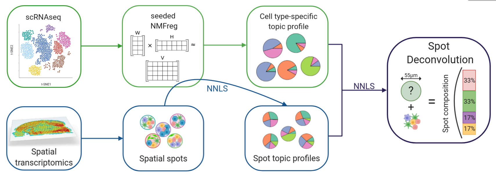

# SingleR - Single-cell Recognition

[](https://bioconductor.org/packages/release/bioc/html/SPOTlight.html "How long has SPOTlight been in a release of Bioconductor")
[](https://bioconductor.org/packages/stats/bioc/SPOTlight/ "Ranking by number of downloads. A lower number means the package is downloaded more frequently. Determined within a package type (software, experiment, annotation, workflow) and uses the number of distinct IPs for the last 12 months")
[](https://support.bioconductor.org/t/SPOTlight/ "Support site activity for SPOTlight, last 6 months: tagged questions/avg. answers per question/avg. comments per question/accepted answers, or 0 if no tagged posts.")

**Current build status**
- `release` [](https://bioconductor.org/packages/release/bioc/html/SPOTlight.html#archives "Whether SPOTlight release is available on all platforms") 
[](https://bioconductor.org/packages/release/bioc/html/SPOTlight.html#since "Number of recursive dependencies needed to install package")
[](https://bioconductor.org/checkResults/devel/bioc-LATEST/SPOTlight "Time since last commit, possible values: today, < 1 week, < 1 month, < 3 months, since release, before release")
[](https://bioconductor.org/checkResults/release/bioc-LATEST/SPOTlight/ "Bioconductor release build")
- `development` [](https://bioconductor.org/packages/devel/bioc/html/SPOTlight.html#archives "Whether SPOTlight devel is available on all platforms") 
[](https://bioconductor.org/packages/devel/bioc/html/SPOTlight.html#since "Number of recursive dependencies needed to install package")
[](https://bioconductor.org/checkResults/devel/bioc-LATEST/SPOTlight "Time since last commit, possible values: today, < 1 week, < 1 month, < 3 months, since release, before release")
[](https://bioconductor.org/checkResults/devel/bioc-LATEST/SPOTlight/ "Bioconductor devel build")

# Welcome to `SPOTlight` 

### We are currently on the process of submitting SPOTlight to bioconductor and there have been some styling changes on this branch compared to previous releases. If you want to use the version we are currently submitting feel free to look at the updated vignette [here](https://github.com/MarcElosua/SPOTlight/blob/main/vignettes/SPOTlight_kidney.Rmd). If you want to keep using the previous versions, you can still find it in the [spotlight-0.1.7 branch](https://github.com/MarcElosua/SPOTlight/tree/spotlight-0.1.7) and follow the previous [vignette](https://marcelosua.github.io/SPOTlight/).

`SPOTlight` provides a tool that enables the deconvolution of mixtures of cells from a single-cell reference. Originally developed for 10X's Visium - spatial transcriptomics- technology, it can be used for all technologies that output mixtures of cells. It is compatible with Bioconductor's `SingleCellExperiment` and `SpatialExperiment` classes as well as with `Seurat` objects. Furthermore, the package also provides visualization tools to assess the results of the deconvolution. Briefly, `SPOTlight` is based on finding topic profile signatures, by means of an NMFreg model, for each cell type and then optimizing the cell types proportions to fit the mixture we want to deconvolute.



## Installation

``` r
install.packages("BiocManager")
BiocManager::install("SPOTlight")
# Or the devel version
BiocManager::install("SPOTlight", version = "devel")
```

Alternatively, you can install it from GitHub using the [devtools](https://github.com/hadley/devtools) package.

``` r
install.packages("devtools")
library(devtools)
install_github("https://github.com/MarcElosua/SPOTlight")
```

### References

-   Elosua-Bayes M, Nieto P, Mereu E, Gut I, Heyn H (2021): *SPOTlight: seeded NMF regression to deconvolute spatial transcriptomics spots with single-cell transcriptomes*. **Nucleic Acids Res** 49(9):e50. <doi:10.1093/nar/gkab043>.

------------------------------------------------------------------------

### Contributors

SPOTlight was originally developed by [Marc Elosua Bayes](https://github.com/MarcElosua/) and has received substantial additional contributions from [Helena L. Crowell](https://github.com/HelenaLC).

### Issues - Ideas?

`SPOTlight` is still under active development. We greatly welcome (and highly encourage!) all feedback, bug reports and suggestions for improvement [here](https://github.com/MarcElosua/SPOTlight/issues). **Please make sure to raise issues with a [reproducible example](https://www.tidyverse.org/help/) and the output of your `sessionInfo()`.**
