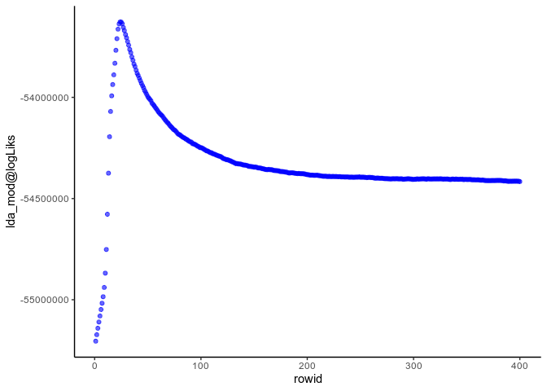

<!-- README.md is generated from README.Rmd. Please edit that file -->

# SpatialDeconTest

<!-- badges: start -->

[](https://travis-ci.org/MarcElosua/SpatialDeconTest)
[](https://ci.appveyor.com/project/MarcElosua/SpatialDeconTest)
[](https://codecov.io/gh/MarcElosua/SpatialDeconTest?branch=master)
<!-- badges: end -->

The goal of SpatialDeconTest is to provide a tool that enables the
deconvolution of cell types and cell type proportions present within
each spot obtained from 10X’s visium - spatial trancsiptomics-
technology.

## Installation

You can install the latest version from the GitHub repository
[SpatialDeconTest](https://github.com/MarcElosua/SpatialDeconTest) with:

``` r
# install.packages("devtools")
devtools::install_github("https://github.com/MarcElosua/SpatialDeconTest")
```

## Example

This is a basic example which shows you how to run the workflow using
more specific or more general functions:

``` r
library(org.Hs.eg.db)
#> Loading required package: AnnotationDbi
#> Loading required package: stats4
#> Loading required package: BiocGenerics
#> Loading required package: parallel
#> 
#> Attaching package: 'BiocGenerics'
#> The following objects are masked from 'package:parallel':
#> 
#>     clusterApply, clusterApplyLB, clusterCall, clusterEvalQ,
#>     clusterExport, clusterMap, parApply, parCapply, parLapply,
#>     parLapplyLB, parRapply, parSapply, parSapplyLB
#> The following objects are masked from 'package:stats':
#> 
#>     IQR, mad, sd, var, xtabs
#> The following objects are masked from 'package:base':
#> 
#>     anyDuplicated, append, as.data.frame, basename, cbind, colnames,
#>     dirname, do.call, duplicated, eval, evalq, Filter, Find, get, grep,
#>     grepl, intersect, is.unsorted, lapply, Map, mapply, match, mget,
#>     order, paste, pmax, pmax.int, pmin, pmin.int, Position, rank,
#>     rbind, Reduce, rownames, sapply, setdiff, sort, table, tapply,
#>     union, unique, unsplit, which, which.max, which.min
#> Loading required package: Biobase
#> Welcome to Bioconductor
#> 
#>     Vignettes contain introductory material; view with
#>     'browseVignettes()'. To cite Bioconductor, see
#>     'citation("Biobase")', and for packages 'citation("pkgname")'.
#> Loading required package: IRanges
#> Loading required package: S4Vectors
#> 
#> Attaching package: 'S4Vectors'
#> The following object is masked from 'package:base':
#> 
#>     expand.grid
#> 
library(SpatialDeconTest)
#> Loading required package: SingleCellExperiment
#> Loading required package: SummarizedExperiment
#> Loading required package: GenomicRanges
#> Loading required package: GenomeInfoDb
#> Loading required package: DelayedArray
#> Loading required package: matrixStats
#> 
#> Attaching package: 'matrixStats'
#> The following objects are masked from 'package:Biobase':
#> 
#>     anyMissing, rowMedians
#> Loading required package: BiocParallel
#> 
#> Attaching package: 'DelayedArray'
#> The following objects are masked from 'package:matrixStats':
#> 
#>     colMaxs, colMins, colRanges, rowMaxs, rowMins, rowRanges
#> The following objects are masked from 'package:base':
#> 
#>     aperm, apply, rowsum
#> Loading required package: Seurat
#> 
#> Attaching package: 'Seurat'
#> The following object is masked from 'package:SummarizedExperiment':
#> 
#>     Assays
#> Loading required package: Matrix
#> 
#> Attaching package: 'Matrix'
#> The following object is masked from 'package:S4Vectors':
#> 
#>     expand
#> Loading required package: topicmodels
#> Loading required package: dtplyr
#> Loading required package: foreach
#> Loading required package: doParallel
#> Loading required package: iterators
#> Loading required package: arrangements
#> Loading required package: philentropy
#> 
#> Attaching package: 'philentropy'
#> The following object is masked from 'package:SummarizedExperiment':
#> 
#>     distance
#> The following object is masked from 'package:GenomicRanges':
#> 
#>     distance
#> The following object is masked from 'package:IRanges':
#> 
#>     distance
#> Loading required package: pdist
#> Loading required package: doSNOW
#> Loading required package: snow
#> 
#> Attaching package: 'snow'
#> The following objects are masked from 'package:BiocGenerics':
#> 
#>     clusterApply, clusterApplyLB, clusterCall, clusterEvalQ,
#>     clusterExport, clusterMap, clusterSplit, parApply, parCapply,
#>     parLapply, parRapply, parSapply
#> The following objects are masked from 'package:parallel':
#> 
#>     clusterApply, clusterApplyLB, clusterCall, clusterEvalQ,
#>     clusterExport, clusterMap, clusterSplit, makeCluster, parApply,
#>     parCapply, parLapply, parRapply, parSapply, splitIndices,
#>     stopCluster
#> Loading required package: tibble
#> Loading required package: dplyr
#> 
#> Attaching package: 'dplyr'
#> The following object is masked from 'package:matrixStats':
#> 
#>     count
#> The following objects are masked from 'package:GenomicRanges':
#> 
#>     intersect, setdiff, union
#> The following object is masked from 'package:GenomeInfoDb':
#> 
#>     intersect
#> The following object is masked from 'package:AnnotationDbi':
#> 
#>     select
#> The following objects are masked from 'package:IRanges':
#> 
#>     collapse, desc, intersect, setdiff, slice, union
#> The following objects are masked from 'package:S4Vectors':
#> 
#>     first, intersect, rename, setdiff, setequal, union
#> The following object is masked from 'package:Biobase':
#> 
#>     combine
#> The following objects are masked from 'package:BiocGenerics':
#> 
#>     combine, intersect, setdiff, union
#> The following objects are masked from 'package:stats':
#> 
#>     filter, lag
#> The following objects are masked from 'package:base':
#> 
#>     intersect, setdiff, setequal, union
#> Loading required package: purrr
#> 
#> Attaching package: 'purrr'
#> The following objects are masked from 'package:foreach':
#> 
#>     accumulate, when
#> The following object is masked from 'package:DelayedArray':
#> 
#>     simplify
#> The following object is masked from 'package:GenomicRanges':
#> 
#>     reduce
#> The following object is masked from 'package:IRanges':
#> 
#>     reduce
```

``` r
tech <- '10x'
dwn_smplng <- 'none'
tissue <- 'mixology'

source('misc/paths_vrs.R')
# source('utils/bin.r')
```

## Single Cell Mixology

In this step by step analysis we will assess how the deconvolution
performs on the single cell mixology data generate by Matthew E. Ritchie
in his paper [Benchmarking single cell RNA-sequencing analysis pipelines
using mixture control
experiments](https://www.ncbi.nlm.nih.gov/pubmed/31133762). All data can
be accessed in this [sc\_mixology github
repository](https://github.com/LuyiTian/sc_mixology). It uses 5
different cell types for the scRNAseq: human lung adenocarcinoma cell
lines HCC827, H1975, H2228, H838, and A549. To do the mixed spots it
only uses the first 3 (HCC827, H1975, H2228) to do 9 cell combinations.

We are going to use this data since it is put out to carry out
benchmarking experiments and is a good controled way of knowing wich
combination of 9-cells is in each
mixture.

### Loading the data

``` r
# load('data/mixture_data/9cellmix_qc.RData') # This file loads single cell experiment objects
load(url('https://github.com/LuyiTian/sc_mixology/raw/master/data/9cellmix_qc.RData'))
# sce_9cells_qc;sce_POP_sel_qc;sce_SC1_qc;sce_SC2_qc;sce_SC3_qc;sce_SC4_qc 

# load('data/mixture_data/sincell_with_class_5cl.RData') # This file loads single cell experiment objects
load(url('https://github.com/LuyiTian/sc_mixology/raw/master/data/sincell_with_class_5cl.RData'))
# sc_Celseq2_5cl_p1;sc_Celseq2_5cl_p2;sc_Celseq2_5cl_p3;sce_sc_10x_5cl_qc
# All this files are single cell

# load('data/mixture_data/mRNAmix_qc.RData') # This file loads single cell experiment objects
# sce2_qc;sce8_qc
```

To train the model we will use the 10x data from the file
sincell\_with\_class\_5cl.RData. We will first run some QC tests to
assess the quality. The first step will be to convert it to a Seurat
object.

``` r
se_sc_10x_5cl_qc <- Seurat::CreateSeuratObject(counts = sce_sc_10x_5cl_qc@assays$data$counts,
                                               project = '10x_mixology', 
                                               assay = 'RNA', 
                                               meta.data = data.frame(colData(sce_sc_10x_5cl_qc)))
```

### Downsampling + Data preprocessing

If the dataset is very large we want to downsample it, both in terms of
number of cells and number of genes, to train the model. To do this
downsampling we want to keep a representative amount of cells per
cluster and the most important genes. We will select first the genes of
interest, to do so we will grab each cluster’s markers plus the 5000
most variable genes.  
We can extract the top marker genes from each cluster and select the
unique ones to use as seeds for the
model

``` r
se_sc_10x_5cl_qc <- se_sc_10x_5cl_qc[,se_sc_10x_5cl_qc$cell_line_demuxlet %in% c("HCC827","H1975","H2228")]

#### Extract the top marker genes from each cluster ####
Idents(object = se_sc_10x_5cl_qc) <- se_sc_10x_5cl_qc$cell_line_demuxlet
cluster_markers_all <- Seurat::FindAllMarkers(object = se_sc_10x_5cl_qc, verbose = TRUE, only.pos = T)
#> Calculating cluster HCC827
#> Calculating cluster H1975
#> Calculating cluster H2228

se_sc_10x_5cl_qc <- downsample_se_obj(se_obj = se_sc_10x_5cl_qc, clust_vr = 'cell_line_demuxlet', cluster_markers_all = cluster_markers_all)
# saveRDS(object = se_sc_10x_5cl_qc,file = 'se_sc_10x_5cl_qc.RDS')
# se_sc_10x_5cl_qc <- readRDS(file = 'se_sc_10x_5cl_qc.RDS')
```

### Train LDA model

Once we have the data ready to pass to the model we can train it as
shown below. For larger and more complex datasets ~8000 gibbs iterations
are recommended. If more iterations are needed you can always resume
where you left off and run more iterations on the previosuly trained
model.

``` r
#### Train LDA model ####
lda_mod_ls <- train_lda(se_obj = se_sc_10x_5cl_qc, clust_vr = 'cell_line_demuxlet', cluster_markers_all = cluster_markers_all, al = 0.01, verbose = 1, iter = 300, burnin = 100, best = TRUE, keep = 1)
#> Selecting by logFC_z
#> [1] 1
#> [1] 2
#> [1] 3
#> [1] "2020-01-27 18:55:18 CET"
#> K = 3; V = 8352; M = 300
#> Sampling 400 iterations!
#> Iteration 1 ...
#> Iteration 2 ...
#> Iteration 3 ...
#> Iteration 4 ...
#> Iteration 5 ...
#> Iteration 6 ...
#> Iteration 7 ...
#> Iteration 8 ...
#> Iteration 9 ...
#> Iteration 10 ...
#> Iteration 11 ...
#> Iteration 12 ...
#> Iteration 13 ...
#> Iteration 14 ...
#> Iteration 15 ...
#> Iteration 16 ...
#> Iteration 17 ...
#> Iteration 18 ...
#> Iteration 19 ...
#> Iteration 20 ...
#> Iteration 21 ...
#> Iteration 22 ...
#> Iteration 23 ...
#> Iteration 24 ...
#> Iteration 25 ...
#> Iteration 26 ...
#> Iteration 27 ...
#> Iteration 28 ...
#> Iteration 29 ...
#> Iteration 30 ...
#> Iteration 31 ...
#> Iteration 32 ...
#> Iteration 33 ...
#> Iteration 34 ...
#> Iteration 35 ...
#> Iteration 36 ...
#> Iteration 37 ...
#> Iteration 38 ...
#> Iteration 39 ...
#> Iteration 40 ...
#> Iteration 41 ...
#> Iteration 42 ...
#> Iteration 43 ...
#> Iteration 44 ...
#> Iteration 45 ...
#> Iteration 46 ...
#> Iteration 47 ...
#> Iteration 48 ...
#> Iteration 49 ...
#> Iteration 50 ...
#> Iteration 51 ...
#> Iteration 52 ...
#> Iteration 53 ...
#> Iteration 54 ...
#> Iteration 55 ...
#> Iteration 56 ...
#> Iteration 57 ...
#> Iteration 58 ...
#> Iteration 59 ...
#> Iteration 60 ...
#> Iteration 61 ...
#> Iteration 62 ...
#> Iteration 63 ...
#> Iteration 64 ...
#> Iteration 65 ...
#> Iteration 66 ...
#> Iteration 67 ...
#> Iteration 68 ...
#> Iteration 69 ...
#> Iteration 70 ...
#> Iteration 71 ...
#> Iteration 72 ...
#> Iteration 73 ...
#> Iteration 74 ...
#> Iteration 75 ...
#> Iteration 76 ...
#> Iteration 77 ...
#> Iteration 78 ...
#> Iteration 79 ...
#> Iteration 80 ...
#> Iteration 81 ...
#> Iteration 82 ...
#> Iteration 83 ...
#> Iteration 84 ...
#> Iteration 85 ...
#> Iteration 86 ...
#> Iteration 87 ...
#> Iteration 88 ...
#> Iteration 89 ...
#> Iteration 90 ...
#> Iteration 91 ...
#> Iteration 92 ...
#> Iteration 93 ...
#> Iteration 94 ...
#> Iteration 95 ...
#> Iteration 96 ...
#> Iteration 97 ...
#> Iteration 98 ...
#> Iteration 99 ...
#> Iteration 100 ...
#> Iteration 101 ...
#> Iteration 102 ...
#> Iteration 103 ...
#> Iteration 104 ...
#> Iteration 105 ...
#> Iteration 106 ...
#> Iteration 107 ...
#> Iteration 108 ...
#> Iteration 109 ...
#> Iteration 110 ...
#> Iteration 111 ...
#> Iteration 112 ...
#> Iteration 113 ...
#> Iteration 114 ...
#> Iteration 115 ...
#> Iteration 116 ...
#> Iteration 117 ...
#> Iteration 118 ...
#> Iteration 119 ...
#> Iteration 120 ...
#> Iteration 121 ...
#> Iteration 122 ...
#> Iteration 123 ...
#> Iteration 124 ...
#> Iteration 125 ...
#> Iteration 126 ...
#> Iteration 127 ...
#> Iteration 128 ...
#> Iteration 129 ...
#> Iteration 130 ...
#> Iteration 131 ...
#> Iteration 132 ...
#> Iteration 133 ...
#> Iteration 134 ...
#> Iteration 135 ...
#> Iteration 136 ...
#> Iteration 137 ...
#> Iteration 138 ...
#> Iteration 139 ...
#> Iteration 140 ...
#> Iteration 141 ...
#> Iteration 142 ...
#> Iteration 143 ...
#> Iteration 144 ...
#> Iteration 145 ...
#> Iteration 146 ...
#> Iteration 147 ...
#> Iteration 148 ...
#> Iteration 149 ...
#> Iteration 150 ...
#> Iteration 151 ...
#> Iteration 152 ...
#> Iteration 153 ...
#> Iteration 154 ...
#> Iteration 155 ...
#> Iteration 156 ...
#> Iteration 157 ...
#> Iteration 158 ...
#> Iteration 159 ...
#> Iteration 160 ...
#> Iteration 161 ...
#> Iteration 162 ...
#> Iteration 163 ...
#> Iteration 164 ...
#> Iteration 165 ...
#> Iteration 166 ...
#> Iteration 167 ...
#> Iteration 168 ...
#> Iteration 169 ...
#> Iteration 170 ...
#> Iteration 171 ...
#> Iteration 172 ...
#> Iteration 173 ...
#> Iteration 174 ...
#> Iteration 175 ...
#> Iteration 176 ...
#> Iteration 177 ...
#> Iteration 178 ...
#> Iteration 179 ...
#> Iteration 180 ...
#> Iteration 181 ...
#> Iteration 182 ...
#> Iteration 183 ...
#> Iteration 184 ...
#> Iteration 185 ...
#> Iteration 186 ...
#> Iteration 187 ...
#> Iteration 188 ...
#> Iteration 189 ...
#> Iteration 190 ...
#> Iteration 191 ...
#> Iteration 192 ...
#> Iteration 193 ...
#> Iteration 194 ...
#> Iteration 195 ...
#> Iteration 196 ...
#> Iteration 197 ...
#> Iteration 198 ...
#> Iteration 199 ...
#> Iteration 200 ...
#> Iteration 201 ...
#> Iteration 202 ...
#> Iteration 203 ...
#> Iteration 204 ...
#> Iteration 205 ...
#> Iteration 206 ...
#> Iteration 207 ...
#> Iteration 208 ...
#> Iteration 209 ...
#> Iteration 210 ...
#> Iteration 211 ...
#> Iteration 212 ...
#> Iteration 213 ...
#> Iteration 214 ...
#> Iteration 215 ...
#> Iteration 216 ...
#> Iteration 217 ...
#> Iteration 218 ...
#> Iteration 219 ...
#> Iteration 220 ...
#> Iteration 221 ...
#> Iteration 222 ...
#> Iteration 223 ...
#> Iteration 224 ...
#> Iteration 225 ...
#> Iteration 226 ...
#> Iteration 227 ...
#> Iteration 228 ...
#> Iteration 229 ...
#> Iteration 230 ...
#> Iteration 231 ...
#> Iteration 232 ...
#> Iteration 233 ...
#> Iteration 234 ...
#> Iteration 235 ...
#> Iteration 236 ...
#> Iteration 237 ...
#> Iteration 238 ...
#> Iteration 239 ...
#> Iteration 240 ...
#> Iteration 241 ...
#> Iteration 242 ...
#> Iteration 243 ...
#> Iteration 244 ...
#> Iteration 245 ...
#> Iteration 246 ...
#> Iteration 247 ...
#> Iteration 248 ...
#> Iteration 249 ...
#> Iteration 250 ...
#> Iteration 251 ...
#> Iteration 252 ...
#> Iteration 253 ...
#> Iteration 254 ...
#> Iteration 255 ...
#> Iteration 256 ...
#> Iteration 257 ...
#> Iteration 258 ...
#> Iteration 259 ...
#> Iteration 260 ...
#> Iteration 261 ...
#> Iteration 262 ...
#> Iteration 263 ...
#> Iteration 264 ...
#> Iteration 265 ...
#> Iteration 266 ...
#> Iteration 267 ...
#> Iteration 268 ...
#> Iteration 269 ...
#> Iteration 270 ...
#> Iteration 271 ...
#> Iteration 272 ...
#> Iteration 273 ...
#> Iteration 274 ...
#> Iteration 275 ...
#> Iteration 276 ...
#> Iteration 277 ...
#> Iteration 278 ...
#> Iteration 279 ...
#> Iteration 280 ...
#> Iteration 281 ...
#> Iteration 282 ...
#> Iteration 283 ...
#> Iteration 284 ...
#> Iteration 285 ...
#> Iteration 286 ...
#> Iteration 287 ...
#> Iteration 288 ...
#> Iteration 289 ...
#> Iteration 290 ...
#> Iteration 291 ...
#> Iteration 292 ...
#> Iteration 293 ...
#> Iteration 294 ...
#> Iteration 295 ...
#> Iteration 296 ...
#> Iteration 297 ...
#> Iteration 298 ...
#> Iteration 299 ...
#> Iteration 300 ...
#> Iteration 301 ...
#> Iteration 302 ...
#> Iteration 303 ...
#> Iteration 304 ...
#> Iteration 305 ...
#> Iteration 306 ...
#> Iteration 307 ...
#> Iteration 308 ...
#> Iteration 309 ...
#> Iteration 310 ...
#> Iteration 311 ...
#> Iteration 312 ...
#> Iteration 313 ...
#> Iteration 314 ...
#> Iteration 315 ...
#> Iteration 316 ...
#> Iteration 317 ...
#> Iteration 318 ...
#> Iteration 319 ...
#> Iteration 320 ...
#> Iteration 321 ...
#> Iteration 322 ...
#> Iteration 323 ...
#> Iteration 324 ...
#> Iteration 325 ...
#> Iteration 326 ...
#> Iteration 327 ...
#> Iteration 328 ...
#> Iteration 329 ...
#> Iteration 330 ...
#> Iteration 331 ...
#> Iteration 332 ...
#> Iteration 333 ...
#> Iteration 334 ...
#> Iteration 335 ...
#> Iteration 336 ...
#> Iteration 337 ...
#> Iteration 338 ...
#> Iteration 339 ...
#> Iteration 340 ...
#> Iteration 341 ...
#> Iteration 342 ...
#> Iteration 343 ...
#> Iteration 344 ...
#> Iteration 345 ...
#> Iteration 346 ...
#> Iteration 347 ...
#> Iteration 348 ...
#> Iteration 349 ...
#> Iteration 350 ...
#> Iteration 351 ...
#> Iteration 352 ...
#> Iteration 353 ...
#> Iteration 354 ...
#> Iteration 355 ...
#> Iteration 356 ...
#> Iteration 357 ...
#> Iteration 358 ...
#> Iteration 359 ...
#> Iteration 360 ...
#> Iteration 361 ...
#> Iteration 362 ...
#> Iteration 363 ...
#> Iteration 364 ...
#> Iteration 365 ...
#> Iteration 366 ...
#> Iteration 367 ...
#> Iteration 368 ...
#> Iteration 369 ...
#> Iteration 370 ...
#> Iteration 371 ...
#> Iteration 372 ...
#> Iteration 373 ...
#> Iteration 374 ...
#> Iteration 375 ...
#> Iteration 376 ...
#> Iteration 377 ...
#> Iteration 378 ...
#> Iteration 379 ...
#> Iteration 380 ...
#> Iteration 381 ...
#> Iteration 382 ...
#> Iteration 383 ...
#> Iteration 384 ...
#> Iteration 385 ...
#> Iteration 386 ...
#> Iteration 387 ...
#> Iteration 388 ...
#> Iteration 389 ...
#> Iteration 390 ...
#> Iteration 391 ...
#> Iteration 392 ...
#> Iteration 393 ...
#> Iteration 394 ...
#> Iteration 395 ...
#> Iteration 396 ...
#> Iteration 397 ...
#> Iteration 398 ...
#> Iteration 399 ...
#> Iteration 400 ...
#> Gibbs sampling completed!
#> [1] "LDA seeded took: 1.65692808628082"

# Select the best model
lda_mod <- lda_mod_ls[[1]]
# saveRDS(object = lda_mod,file = 'lda_mod.RDS')
# lda_mod <- readRDS(file = 'lda_mod.RDS')
```

### Spot Deconvolution

Create all posible combinations between 3-8 cells per spot. We get the
cell composition and the topic profile por each combination. We will
compare the topic profiles of all these synthetic spots with the
predicted topic profiles obtained from running the spatial spots through
the LDA model. The prediction process can be parallelized to speed it
up.

Mixed spots representing the grount truth are obtained from the
sce\_9cells\_qc object where all possible combinations of HCC827, H1975,
H2228 were carried out.

``` r
# Extract count matrix
spot_counts <- Matrix(sce_9cells_qc@assays$data$counts,sparse = T)
ens_genes <- rownames(spot_counts)

# Convert Ensembl ids to symbols
# library(org.Hs.eg.db)
symb_genes <- mapIds(x = org.Hs.eg.db, keys = ens_genes, column = 'SYMBOL', keytype = 'ENSEMBL')
#> 'select()' returned 1:many mapping between keys and columns
rownames(spot_counts) <- symb_genes

# Subset to genes used to train the model
spot_counts <- spot_counts[rownames(spot_counts) %in% lda_mod@terms, ]

# Transpose spot_counts so its SPOTxGENES
spot_counts <- BiocGenerics::t(spot_counts)

decon_mtrx <- spot_deconvolution(lda_mod = lda_mod, se_obj = se_sc_10x_5cl_qc, 
                                     clust_vr = 'cell_line_demuxlet',  spot_counts = spot_counts, 
                                     verbose = TRUE, ncores = 5, parallelize = TRUE,
                                     top_dist = 1000, top_JSD = 15)
#> [1] "Generating all synthetic spot combinations"
#> [1] "Creating synthetic spots"
#>   |                                                                              |                                                                      |   0%  |                                                                              |                                                                      |   1%  |                                                                              |=                                                                     |   1%  |                                                                              |=                                                                     |   2%  |                                                                              |==                                                                    |   3%  |                                                                              |===                                                                   |   4%  |                                                                              |===                                                                   |   5%  |                                                                              |====                                                                  |   5%  |                                                                              |====                                                                  |   6%  |                                                                              |=====                                                                 |   6%  |                                                                              |=====                                                                 |   7%  |                                                                              |=====                                                                 |   8%  |                                                                              |======                                                                |   8%  |                                                                              |======                                                                |   9%  |                                                                              |=======                                                               |  10%  |                                                                              |========                                                              |  11%  |                                                                              |========                                                              |  12%  |                                                                              |=========                                                             |  12%  |                                                                              |=========                                                             |  13%  |                                                                              |=========                                                             |  14%  |                                                                              |==========                                                            |  14%  |                                                                              |==========                                                            |  15%  |                                                                              |===========                                                           |  15%  |                                                                              |===========                                                           |  16%  |                                                                              |============                                                          |  17%  |                                                                              |=============                                                         |  18%  |                                                                              |=============                                                         |  19%  |                                                                              |==============                                                        |  19%  |                                                                              |==============                                                        |  20%  |                                                                              |==============                                                        |  21%  |                                                                              |===============                                                       |  21%  |                                                                              |===============                                                       |  22%  |                                                                              |================                                                      |  23%  |                                                                              |=================                                                     |  24%  |                                                                              |=================                                                     |  25%  |                                                                              |==================                                                    |  25%  |                                                                              |==================                                                    |  26%  |                                                                              |===================                                                   |  26%  |                                                                              |===================                                                   |  27%  |                                                                              |===================                                                   |  28%  |                                                                              |====================                                                  |  28%  |                                                                              |====================                                                  |  29%  |                                                                              |=====================                                                 |  30%  |                                                                              |======================                                                |  31%  |                                                                              |======================                                                |  32%  |                                                                              |=======================                                               |  32%  |                                                                              |=======================                                               |  33%  |                                                                              |=======================                                               |  34%  |                                                                              |========================                                              |  34%  |                                                                              |========================                                              |  35%  |                                                                              |=========================                                             |  35%  |                                                                              |=========================                                             |  36%  |                                                                              |==========================                                            |  37%  |                                                                              |===========================                                           |  38%  |                                                                              |===========================                                           |  39%  |                                                                              |============================                                          |  39%  |                                                                              |============================                                          |  40%  |                                                                              |============================                                          |  41%  |                                                                              |=============================                                         |  41%  |                                                                              |=============================                                         |  42%  |                                                                              |==============================                                        |  43%  |                                                                              |===============================                                       |  44%  |                                                                              |===============================                                       |  45%  |                                                                              |================================                                      |  45%  |                                                                              |================================                                      |  46%  |                                                                              |=================================                                     |  46%  |                                                                              |=================================                                     |  47%  |                                                                              |=================================                                     |  48%  |                                                                              |==================================                                    |  48%  |                                                                              |==================================                                    |  49%  |                                                                              |===================================                                   |  50%  |                                                                              |====================================                                  |  51%  |                                                                              |====================================                                  |  52%  |                                                                              |=====================================                                 |  52%  |                                                                              |=====================================                                 |  53%  |                                                                              |=====================================                                 |  54%  |                                                                              |======================================                                |  54%  |                                                                              |======================================                                |  55%  |                                                                              |=======================================                               |  55%  |                                                                              |=======================================                               |  56%  |                                                                              |========================================                              |  57%  |                                                                              |=========================================                             |  58%  |                                                                              |=========================================                             |  59%  |                                                                              |==========================================                            |  59%  |                                                                              |==========================================                            |  60%  |                                                                              |==========================================                            |  61%  |                                                                              |===========================================                           |  61%  |                                                                              |===========================================                           |  62%  |                                                                              |============================================                          |  63%  |                                                                              |=============================================                         |  64%  |                                                                              |=============================================                         |  65%  |                                                                              |==============================================                        |  65%  |                                                                              |==============================================                        |  66%  |                                                                              |===============================================                       |  66%  |                                                                              |===============================================                       |  67%  |                                                                              |===============================================                       |  68%  |                                                                              |================================================                      |  68%  |                                                                              |================================================                      |  69%  |                                                                              |=================================================                     |  70%  |                                                                              |==================================================                    |  71%  |                                                                              |==================================================                    |  72%  |                                                                              |===================================================                   |  72%  |                                                                              |===================================================                   |  73%  |                                                                              |===================================================                   |  74%  |                                                                              |====================================================                  |  74%  |                                                                              |====================================================                  |  75%  |                                                                              |=====================================================                 |  75%  |                                                                              |=====================================================                 |  76%  |                                                                              |======================================================                |  77%  |                                                                              |=======================================================               |  78%  |                                                                              |=======================================================               |  79%  |                                                                              |========================================================              |  79%  |                                                                              |========================================================              |  80%  |                                                                              |========================================================              |  81%  |                                                                              |=========================================================             |  81%  |                                                                              |=========================================================             |  82%  |                                                                              |==========================================================            |  83%  |                                                                              |===========================================================           |  84%  |                                                                              |===========================================================           |  85%  |                                                                              |============================================================          |  85%  |                                                                              |============================================================          |  86%  |                                                                              |=============================================================         |  86%  |                                                                              |=============================================================         |  87%  |                                                                              |=============================================================         |  88%  |                                                                              |==============================================================        |  88%  |                                                                              |==============================================================        |  89%  |                                                                              |===============================================================       |  90%  |                                                                              |================================================================      |  91%  |                                                                              |================================================================      |  92%  |                                                                              |=================================================================     |  92%  |                                                                              |=================================================================     |  93%  |                                                                              |=================================================================     |  94%  |                                                                              |==================================================================    |  94%  |                                                                              |==================================================================    |  95%  |                                                                              |===================================================================   |  95%  |                                                                              |===================================================================   |  96%  |                                                                              |====================================================================  |  97%  |                                                                              |===================================================================== |  98%  |                                                                              |===================================================================== |  99%  |                                                                              |======================================================================|  99%  |                                                                              |======================================================================| 100%
#> [1] "Creation of 155 synthetic spot profiles took: 0 minutes"
#> [1] "Predict topic profiles of spatial spots"
#> [1] "Running predictions"
#>   |                                                                              |                                                                      |   0%  |                                                                              |==                                                                    |   3%  |                                                                              |====                                                                  |   5%  |                                                                              |=====                                                                 |   8%  |                                                                              |=======                                                               |  10%  |                                                                              |=========                                                             |  13%  |                                                                              |===========                                                           |  15%  |                                                                              |=============                                                         |  18%  |                                                                              |==============                                                        |  21%  |                                                                              |================                                                      |  23%  |                                                                              |==================                                                    |  26%  |                                                                              |====================                                                  |  28%  |                                                                              |======================                                                |  31%  |                                                                              |=======================                                               |  33%  |                                                                              |=========================                                             |  36%  |                                                                              |===========================                                           |  38%  |                                                                              |=============================                                         |  41%  |                                                                              |===============================                                       |  44%  |                                                                              |================================                                      |  46%  |                                                                              |==================================                                    |  49%  |                                                                              |====================================                                  |  51%  |                                                                              |======================================                                |  54%  |                                                                              |=======================================                               |  56%  |                                                                              |=========================================                             |  59%  |                                                                              |===========================================                           |  62%  |                                                                              |=============================================                         |  64%  |                                                                              |===============================================                       |  67%  |                                                                              |================================================                      |  69%  |                                                                              |==================================================                    |  72%  |                                                                              |====================================================                  |  74%  |                                                                              |======================================================                |  77%  |                                                                              |========================================================              |  79%  |                                                                              |=========================================================             |  82%  |                                                                              |===========================================================           |  85%  |                                                                              |=============================================================         |  87%  |                                                                              |===============================================================       |  90%  |                                                                              |=================================================================     |  92%  |                                                                              |==================================================================    |  95%  |                                                                              |====================================================================  |  97%  |                                                                              |======================================================================| 100%[1] "Time to predict: 2"
#> [1] "Perform deconvolution of the spatial spots"
#> [1] "Calculating Jensen-Shannon Divergence"
#>   |                                                                              |                                                                      |   0%  |                                                                              |                                                                      |   1%  |                                                                              |=                                                                     |   1%  |                                                                              |=                                                                     |   2%  |                                                                              |==                                                                    |   2%  |                                                                              |==                                                                    |   3%  |                                                                              |===                                                                   |   4%  |                                                                              |===                                                                   |   5%  |                                                                              |====                                                                  |   5%  |                                                                              |====                                                                  |   6%  |                                                                              |=====                                                                 |   7%  |                                                                              |=====                                                                 |   8%  |                                                                              |======                                                                |   8%  |                                                                              |======                                                                |   9%  |                                                                              |=======                                                               |   9%  |                                                                              |=======                                                               |  10%  |                                                                              |========                                                              |  11%  |                                                                              |========                                                              |  12%  |                                                                              |=========                                                             |  12%  |                                                                              |=========                                                             |  13%  |                                                                              |==========                                                            |  14%  |                                                                              |==========                                                            |  15%  |                                                                              |===========                                                           |  15%  |                                                                              |===========                                                           |  16%  |                                                                              |============                                                          |  16%  |                                                                              |============                                                          |  17%  |                                                                              |============                                                          |  18%  |                                                                              |=============                                                         |  18%  |                                                                              |=============                                                         |  19%  |                                                                              |==============                                                        |  19%  |                                                                              |==============                                                        |  20%  |                                                                              |==============                                                        |  21%  |                                                                              |===============                                                       |  21%  |                                                                              |===============                                                       |  22%  |                                                                              |================                                                      |  22%  |                                                                              |================                                                      |  23%  |                                                                              |================                                                      |  24%  |                                                                              |=================                                                     |  24%  |                                                                              |=================                                                     |  25%  |                                                                              |==================                                                    |  25%  |                                                                              |==================                                                    |  26%  |                                                                              |===================                                                   |  26%  |                                                                              |===================                                                   |  27%  |                                                                              |===================                                                   |  28%  |                                                                              |====================                                                  |  28%  |                                                                              |====================                                                  |  29%  |                                                                              |=====================                                                 |  29%  |                                                                              |=====================                                                 |  30%  |                                                                              |=====================                                                 |  31%  |                                                                              |======================                                                |  31%  |                                                                              |======================                                                |  32%  |                                                                              |=======================                                               |  32%  |                                                                              |=======================                                               |  33%  |                                                                              |=======================                                               |  34%  |                                                                              |========================                                              |  34%  |                                                                              |========================                                              |  35%  |                                                                              |=========================                                             |  35%  |                                                                              |=========================                                             |  36%  |                                                                              |==========================                                            |  37%  |                                                                              |==========================                                            |  38%  |                                                                              |===========================                                           |  38%  |                                                                              |===========================                                           |  39%  |                                                                              |============================                                          |  40%  |                                                                              |============================                                          |  41%  |                                                                              |=============================                                         |  41%  |                                                                              |=============================                                         |  42%  |                                                                              |==============================                                        |  42%  |                                                                              |==============================                                        |  43%  |                                                                              |===============================                                       |  44%  |                                                                              |===============================                                       |  45%  |                                                                              |================================                                      |  45%  |                                                                              |================================                                      |  46%  |                                                                              |=================================                                     |  47%  |                                                                              |=================================                                     |  48%  |                                                                              |==================================                                    |  48%  |                                                                              |==================================                                    |  49%  |                                                                              |===================================                                   |  49%  |                                                                              |===================================                                   |  50%  |                                                                              |===================================                                   |  51%  |                                                                              |====================================                                  |  51%  |                                                                              |====================================                                  |  52%  |                                                                              |=====================================                                 |  52%  |                                                                              |=====================================                                 |  53%  |                                                                              |======================================                                |  54%  |                                                                              |======================================                                |  55%  |                                                                              |=======================================                               |  55%  |                                                                              |=======================================                               |  56%  |                                                                              |========================================                              |  57%  |                                                                              |========================================                              |  58%  |                                                                              |=========================================                             |  58%  |                                                                              |=========================================                             |  59%  |                                                                              |==========================================                            |  59%  |                                                                              |==========================================                            |  60%  |                                                                              |===========================================                           |  61%  |                                                                              |===========================================                           |  62%  |                                                                              |============================================                          |  62%  |                                                                              |============================================                          |  63%  |                                                                              |=============================================                         |  64%  |                                                                              |=============================================                         |  65%  |                                                                              |==============================================                        |  65%  |                                                                              |==============================================                        |  66%  |                                                                              |===============================================                       |  66%  |                                                                              |===============================================                       |  67%  |                                                                              |===============================================                       |  68%  |                                                                              |================================================                      |  68%  |                                                                              |================================================                      |  69%  |                                                                              |=================================================                     |  69%  |                                                                              |=================================================                     |  70%  |                                                                              |=================================================                     |  71%  |                                                                              |==================================================                    |  71%  |                                                                              |==================================================                    |  72%  |                                                                              |===================================================                   |  72%  |                                                                              |===================================================                   |  73%  |                                                                              |===================================================                   |  74%  |                                                                              |====================================================                  |  74%  |                                                                              |====================================================                  |  75%  |                                                                              |=====================================================                 |  75%  |                                                                              |=====================================================                 |  76%  |                                                                              |======================================================                |  76%  |                                                                              |======================================================                |  77%  |                                                                              |======================================================                |  78%  |                                                                              |=======================================================               |  78%  |                                                                              |=======================================================               |  79%  |                                                                              |========================================================              |  79%  |                                                                              |========================================================              |  80%  |                                                                              |========================================================              |  81%  |                                                                              |=========================================================             |  81%  |                                                                              |=========================================================             |  82%  |                                                                              |==========================================================            |  82%  |                                                                              |==========================================================            |  83%  |                                                                              |==========================================================            |  84%  |                                                                              |===========================================================           |  84%  |                                                                              |===========================================================           |  85%  |                                                                              |============================================================          |  85%  |                                                                              |============================================================          |  86%  |                                                                              |=============================================================         |  87%  |                                                                              |=============================================================         |  88%  |                                                                              |==============================================================        |  88%  |                                                                              |==============================================================        |  89%  |                                                                              |===============================================================       |  90%  |                                                                              |===============================================================       |  91%  |                                                                              |================================================================      |  91%  |                                                                              |================================================================      |  92%  |                                                                              |=================================================================     |  92%  |                                                                              |=================================================================     |  93%  |                                                                              |==================================================================    |  94%  |                                                                              |==================================================================    |  95%  |                                                                              |===================================================================   |  95%  |                                                                              |===================================================================   |  96%  |                                                                              |====================================================================  |  97%  |                                                                              |====================================================================  |  98%  |                                                                              |===================================================================== |  98%  |                                                                              |===================================================================== |  99%  |                                                                              |======================================================================|  99%  |                                                                              |======================================================================| 100%
#> Quantiles of the JSD between the best synthetic spot profile and each spot's topic profile are - 0.00151[0.00066-0.00386]

# lda_mod = lda_mod; se_obj = se_sc_10x_5cl_qc; clust_vr = 'cell_line_demuxlet';  spot_counts = spot_counts; verbose = TRUE;
# ncores = 5; parallelize = TRUE; top_dist = 1000; top_JSD = 15
```

### BONUS - Benchmark with synthetic test spots

Furthermore, we can test the performance of the model on synthetically
generated test spots to get a sense on how well the model will perform
on your data.

First of all we can check if the model has achieved an optimal solution
by checking if the maximum-likelyhood has plateaud.

``` r
library(ggplot2)
data.frame(lda_mod@logLiks) %>% 
  rowid_to_column('rowid') %>% 
  ggplot2::ggplot() + 
    geom_point(aes(x = rowid, y=lda_mod@logLiks), alpha = 0.6, col = 'blue') +
    theme_classic()
```



If the model hasn’t plateaud or has plateaud below the best model with
the set number of iterations we can run more iterations on the model
right where we left off. We can change the nstart parameter which will
run the model at 3 different stochastic start points to try to find a
better local minima.

``` r
# Prepare count matrix to pass to the model
se_lda_ready <- prep_seobj_topic_fun(se_obj = se_sc_10x_5cl_qc)

# Set parameters
control_LDA_Gibbs <- list(alpha = 0.01, verbose = 1, keep = 1,
                          seed = round(runif(3,0,1000),0), nstart = 3, best = TRUE,
                          iter = 300, burnin = 100)

# Train model
s_gibbs_seed <- Sys.time()
print(s_gibbs_seed)
set.seed(1234)
lda_mod <- LDA(se_lda_ready, k=k, model = lda_mod,
               method='Gibbs', # Seedwords are only available with Gibbs sampling
               control=control_LDA_Gibbs)
print(sprintf('LDA seeded took: %s', difftime(Sys.time(), s_gibbs_seed, units = 'mins'))) # Takes ~10min
```

If the model had already reached a local minima or we have reached it by
re-training the model we can assess its performance with synthetically
generated test spots. We can generate test spots with the function
*test\_spot\_fun()*
below.

``` r
test_spots_ls <- test_spot_fun(se_obj=se_sc_10x_5cl_qc, clust_vr = 'cell_line_demuxlet', n=1000, verbose=TRUE)
#> Loading packages...
#> [1] "Generating synthetic test spots..."
#>   |                                                                              |                                                                      |   0%  |                                                                              |                                                                      |   1%  |                                                                              |=                                                                     |   1%  |                                                                              |=                                                                     |   2%  |                                                                              |==                                                                    |   2%  |                                                                              |==                                                                    |   3%  |                                                                              |==                                                                    |   4%  |                                                                              |===                                                                   |   4%  |                                                                              |===                                                                   |   5%  |                                                                              |====                                                                  |   5%  |                                                                              |====                                                                  |   6%  |                                                                              |=====                                                                 |   6%  |                                                                              |=====                                                                 |   7%  |                                                                              |=====                                                                 |   8%  |                                                                              |======                                                                |   8%  |                                                                              |======                                                                |   9%  |                                                                              |=======                                                               |   9%  |                                                                              |=======                                                               |  10%  |                                                                              |=======                                                               |  11%  |                                                                              |========                                                              |  11%  |                                                                              |========                                                              |  12%  |                                                                              |=========                                                             |  12%  |                                                                              |=========                                                             |  13%  |                                                                              |=========                                                             |  14%  |                                                                              |==========                                                            |  14%  |                                                                              |==========                                                            |  15%  |                                                                              |===========                                                           |  15%  |                                                                              |===========                                                           |  16%  |                                                                              |============                                                          |  16%  |                                                                              |============                                                          |  17%  |                                                                              |============                                                          |  18%  |                                                                              |=============                                                         |  18%  |                                                                              |=============                                                         |  19%  |                                                                              |==============                                                        |  19%  |                                                                              |==============                                                        |  20%  |                                                                              |==============                                                        |  21%  |                                                                              |===============                                                       |  21%  |                                                                              |===============                                                       |  22%  |                                                                              |================                                                      |  22%  |                                                                              |================                                                      |  23%  |                                                                              |================                                                      |  24%  |                                                                              |=================                                                     |  24%  |                                                                              |=================                                                     |  25%  |                                                                              |==================                                                    |  25%  |                                                                              |==================                                                    |  26%  |                                                                              |===================                                                   |  26%  |                                                                              |===================                                                   |  27%  |                                                                              |===================                                                   |  28%  |                                                                              |====================                                                  |  28%  |                                                                              |====================                                                  |  29%  |                                                                              |=====================                                                 |  29%  |                                                                              |=====================                                                 |  30%  |                                                                              |=====================                                                 |  31%  |                                                                              |======================                                                |  31%  |                                                                              |======================                                                |  32%  |                                                                              |=======================                                               |  32%  |                                                                              |=======================                                               |  33%  |                                                                              |=======================                                               |  34%  |                                                                              |========================                                              |  34%  |                                                                              |========================                                              |  35%  |                                                                              |=========================                                             |  35%  |                                                                              |=========================                                             |  36%  |                                                                              |==========================                                            |  36%  |                                                                              |==========================                                            |  37%  |                                                                              |==========================                                            |  38%  |                                                                              |===========================                                           |  38%  |                                                                              |===========================                                           |  39%  |                                                                              |============================                                          |  39%  |                                                                              |============================                                          |  40%  |                                                                              |============================                                          |  41%  |                                                                              |=============================                                         |  41%  |                                                                              |=============================                                         |  42%  |                                                                              |==============================                                        |  42%  |                                                                              |==============================                                        |  43%  |                                                                              |==============================                                        |  44%  |                                                                              |===============================                                       |  44%  |                                                                              |===============================                                       |  45%  |                                                                              |================================                                      |  45%  |                                                                              |================================                                      |  46%  |                                                                              |=================================                                     |  46%  |                                                                              |=================================                                     |  47%  |                                                                              |=================================                                     |  48%  |                                                                              |==================================                                    |  48%  |                                                                              |==================================                                    |  49%  |                                                                              |===================================                                   |  49%  |                                                                              |===================================                                   |  50%  |                                                                              |===================================                                   |  51%  |                                                                              |====================================                                  |  51%  |                                                                              |====================================                                  |  52%  |                                                                              |=====================================                                 |  52%  |                                                                              |=====================================                                 |  53%  |                                                                              |=====================================                                 |  54%  |                                                                              |======================================                                |  54%  |                                                                              |======================================                                |  55%  |                                                                              |=======================================                               |  55%  |                                                                              |=======================================                               |  56%  |                                                                              |========================================                              |  56%  |                                                                              |========================================                              |  57%  |                                                                              |========================================                              |  58%  |                                                                              |=========================================                             |  58%  |                                                                              |=========================================                             |  59%  |                                                                              |==========================================                            |  59%  |                                                                              |==========================================                            |  60%  |                                                                              |==========================================                            |  61%  |                                                                              |===========================================                           |  61%  |                                                                              |===========================================                           |  62%  |                                                                              |============================================                          |  62%  |                                                                              |============================================                          |  63%  |                                                                              |============================================                          |  64%  |                                                                              |=============================================                         |  64%  |                                                                              |=============================================                         |  65%  |                                                                              |==============================================                        |  65%  |                                                                              |==============================================                        |  66%  |                                                                              |===============================================                       |  66%  |                                                                              |===============================================                       |  67%  |                                                                              |===============================================                       |  68%  |                                                                              |================================================                      |  68%  |                                                                              |================================================                      |  69%  |                                                                              |=================================================                     |  69%  |                                                                              |=================================================                     |  70%  |                                                                              |=================================================                     |  71%  |                                                                              |==================================================                    |  71%  |                                                                              |==================================================                    |  72%  |                                                                              |===================================================                   |  72%  |                                                                              |===================================================                   |  73%  |                                                                              |===================================================                   |  74%  |                                                                              |====================================================                  |  74%  |                                                                              |====================================================                  |  75%  |                                                                              |=====================================================                 |  75%  |                                                                              |=====================================================                 |  76%  |                                                                              |======================================================                |  76%  |                                                                              |======================================================                |  77%  |                                                                              |======================================================                |  78%  |                                                                              |=======================================================               |  78%  |                                                                              |=======================================================               |  79%  |                                                                              |========================================================              |  79%  |                                                                              |========================================================              |  80%  |                                                                              |========================================================              |  81%  |                                                                              |=========================================================             |  81%  |                                                                              |=========================================================             |  82%  |                                                                              |==========================================================            |  82%  |                                                                              |==========================================================            |  83%  |                                                                              |==========================================================            |  84%  |                                                                              |===========================================================           |  84%  |                                                                              |===========================================================           |  85%  |                                                                              |============================================================          |  85%  |                                                                              |============================================================          |  86%  |                                                                              |=============================================================         |  86%  |                                                                              |=============================================================         |  87%  |                                                                              |=============================================================         |  88%  |                                                                              |==============================================================        |  88%  |                                                                              |==============================================================        |  89%  |                                                                              |===============================================================       |  89%  |                                                                              |===============================================================       |  90%  |                                                                              |===============================================================       |  91%  |                                                                              |================================================================      |  91%  |                                                                              |================================================================      |  92%  |                                                                              |=================================================================     |  92%  |                                                                              |=================================================================     |  93%  |                                                                              |=================================================================     |  94%  |                                                                              |==================================================================    |  94%  |                                                                              |==================================================================    |  95%  |                                                                              |===================================================================   |  95%  |                                                                              |===================================================================   |  96%  |                                                                              |====================================================================  |  96%  |                                                                              |====================================================================  |  97%  |                                                                              |====================================================================  |  98%  |                                                                              |===================================================================== |  98%  |                                                                              |===================================================================== |  99%  |                                                                              |======================================================================|  99%  |                                                                              |======================================================================| 100%
#> [1] "Generation of 1000 test spots took 0.563676206270854 mins"
#> [1] "output consists of a list with two dataframes, this first one has the weighted count matrix and the second has the metadata for each spot"
test_spots_counts <- test_spots_ls[[1]]
test_spots_metadata <- test_spots_ls[[2]]
test_spots_metadata <- as.matrix(test_spots_metadata[,which(colnames(test_spots_metadata) != 'name')])
```

We then predict the topic profiles of these synthetic generated
spots

``` r
decon_mtrx <- spot_deconvolution(lda_mod = lda_mod, se_obj = se_sc_10x_5cl_qc,
                                     clust_vr = 'cell_line_demuxlet',  spot_counts = test_spots_counts, 
                                     verbose = TRUE, ncores = 5, parallelize = TRUE,
                                     top_dist = 100, top_JSD = 15)
#> [1] "Generating all synthetic spot combinations"
#> [1] "Creating synthetic spots"
#>   |                                                                              |                                                                      |   0%  |                                                                              |                                                                      |   1%  |                                                                              |=                                                                     |   1%  |                                                                              |=                                                                     |   2%  |                                                                              |==                                                                    |   3%  |                                                                              |===                                                                   |   4%  |                                                                              |===                                                                   |   5%  |                                                                              |====                                                                  |   5%  |                                                                              |====                                                                  |   6%  |                                                                              |=====                                                                 |   6%  |                                                                              |=====                                                                 |   7%  |                                                                              |=====                                                                 |   8%  |                                                                              |======                                                                |   8%  |                                                                              |======                                                                |   9%  |                                                                              |=======                                                               |  10%  |                                                                              |========                                                              |  11%  |                                                                              |========                                                              |  12%  |                                                                              |=========                                                             |  12%  |                                                                              |=========                                                             |  13%  |                                                                              |=========                                                             |  14%  |                                                                              |==========                                                            |  14%  |                                                                              |==========                                                            |  15%  |                                                                              |===========                                                           |  15%  |                                                                              |===========                                                           |  16%  |                                                                              |============                                                          |  17%  |                                                                              |=============                                                         |  18%  |                                                                              |=============                                                         |  19%  |                                                                              |==============                                                        |  19%  |                                                                              |==============                                                        |  20%  |                                                                              |==============                                                        |  21%  |                                                                              |===============                                                       |  21%  |                                                                              |===============                                                       |  22%  |                                                                              |================                                                      |  23%  |                                                                              |=================                                                     |  24%  |                                                                              |=================                                                     |  25%  |                                                                              |==================                                                    |  25%  |                                                                              |==================                                                    |  26%  |                                                                              |===================                                                   |  26%  |                                                                              |===================                                                   |  27%  |                                                                              |===================                                                   |  28%  |                                                                              |====================                                                  |  28%  |                                                                              |====================                                                  |  29%  |                                                                              |=====================                                                 |  30%  |                                                                              |======================                                                |  31%  |                                                                              |======================                                                |  32%  |                                                                              |=======================                                               |  32%  |                                                                              |=======================                                               |  33%  |                                                                              |=======================                                               |  34%  |                                                                              |========================                                              |  34%  |                                                                              |========================                                              |  35%  |                                                                              |=========================                                             |  35%  |                                                                              |=========================                                             |  36%  |                                                                              |==========================                                            |  37%  |                                                                              |===========================                                           |  38%  |                                                                              |===========================                                           |  39%  |                                                                              |============================                                          |  39%  |                                                                              |============================                                          |  40%  |                                                                              |============================                                          |  41%  |                                                                              |=============================                                         |  41%  |                                                                              |=============================                                         |  42%  |                                                                              |==============================                                        |  43%  |                                                                              |===============================                                       |  44%  |                                                                              |===============================                                       |  45%  |                                                                              |================================                                      |  45%  |                                                                              |================================                                      |  46%  |                                                                              |=================================                                     |  46%  |                                                                              |=================================                                     |  47%  |                                                                              |=================================                                     |  48%  |                                                                              |==================================                                    |  48%  |                                                                              |==================================                                    |  49%  |                                                                              |===================================                                   |  50%  |                                                                              |====================================                                  |  51%  |                                                                              |====================================                                  |  52%  |                                                                              |=====================================                                 |  52%  |                                                                              |=====================================                                 |  53%  |                                                                              |=====================================                                 |  54%  |                                                                              |======================================                                |  54%  |                                                                              |======================================                                |  55%  |                                                                              |=======================================                               |  55%  |                                                                              |=======================================                               |  56%  |                                                                              |========================================                              |  57%  |                                                                              |=========================================                             |  58%  |                                                                              |=========================================                             |  59%  |                                                                              |==========================================                            |  59%  |                                                                              |==========================================                            |  60%  |                                                                              |==========================================                            |  61%  |                                                                              |===========================================                           |  61%  |                                                                              |===========================================                           |  62%  |                                                                              |============================================                          |  63%  |                                                                              |=============================================                         |  64%  |                                                                              |=============================================                         |  65%  |                                                                              |==============================================                        |  65%  |                                                                              |==============================================                        |  66%  |                                                                              |===============================================                       |  66%  |                                                                              |===============================================                       |  67%  |                                                                              |===============================================                       |  68%  |                                                                              |================================================                      |  68%  |                                                                              |================================================                      |  69%  |                                                                              |=================================================                     |  70%  |                                                                              |==================================================                    |  71%  |                                                                              |==================================================                    |  72%  |                                                                              |===================================================                   |  72%  |                                                                              |===================================================                   |  73%  |                                                                              |===================================================                   |  74%  |                                                                              |====================================================                  |  74%  |                                                                              |====================================================                  |  75%  |                                                                              |=====================================================                 |  75%  |                                                                              |=====================================================                 |  76%  |                                                                              |======================================================                |  77%  |                                                                              |=======================================================               |  78%  |                                                                              |=======================================================               |  79%  |                                                                              |========================================================              |  79%  |                                                                              |========================================================              |  80%  |                                                                              |========================================================              |  81%  |                                                                              |=========================================================             |  81%  |                                                                              |=========================================================             |  82%  |                                                                              |==========================================================            |  83%  |                                                                              |===========================================================           |  84%  |                                                                              |===========================================================           |  85%  |                                                                              |============================================================          |  85%  |                                                                              |============================================================          |  86%  |                                                                              |=============================================================         |  86%  |                                                                              |=============================================================         |  87%  |                                                                              |=============================================================         |  88%  |                                                                              |==============================================================        |  88%  |                                                                              |==============================================================        |  89%  |                                                                              |===============================================================       |  90%  |                                                                              |================================================================      |  91%  |                                                                              |================================================================      |  92%  |                                                                              |=================================================================     |  92%  |                                                                              |=================================================================     |  93%  |                                                                              |=================================================================     |  94%  |                                                                              |==================================================================    |  94%  |                                                                              |==================================================================    |  95%  |                                                                              |===================================================================   |  95%  |                                                                              |===================================================================   |  96%  |                                                                              |====================================================================  |  97%  |                                                                              |===================================================================== |  98%  |                                                                              |===================================================================== |  99%  |                                                                              |======================================================================|  99%  |                                                                              |======================================================================| 100%
#> [1] "Creation of 155 synthetic spot profiles took: 0 minutes"
#> [1] "Predict topic profiles of spatial spots"
#> [1] "Running predictions"
#>   |                                                                              |                                                                      |   0%  |                                                                              |                                                                      |   1%  |                                                                              |=                                                                     |   1%  |                                                                              |=                                                                     |   2%  |                                                                              |==                                                                    |   2%  |                                                                              |==                                                                    |   3%  |                                                                              |==                                                                    |   4%  |                                                                              |===                                                                   |   4%  |                                                                              |===                                                                   |   5%  |                                                                              |====                                                                  |   5%  |                                                                              |====                                                                  |   6%  |                                                                              |=====                                                                 |   7%  |                                                                              |=====                                                                 |   8%  |                                                                              |======                                                                |   8%  |                                                                              |======                                                                |   9%  |                                                                              |=======                                                               |   9%  |                                                                              |=======                                                               |  10%  |                                                                              |=======                                                               |  11%  |                                                                              |========                                                              |  11%  |                                                                              |========                                                              |  12%  |                                                                              |=========                                                             |  12%  |                                                                              |=========                                                             |  13%  |                                                                              |=========                                                             |  14%  |                                                                              |==========                                                            |  14%  |                                                                              |==========                                                            |  15%  |                                                                              |===========                                                           |  15%  |                                                                              |===========                                                           |  16%  |                                                                              |============                                                          |  16%  |                                                                              |============                                                          |  17%  |                                                                              |============                                                          |  18%  |                                                                              |=============                                                         |  18%  |                                                                              |=============                                                         |  19%  |                                                                              |==============                                                        |  19%  |                                                                              |==============                                                        |  20%  |                                                                              |==============                                                        |  21%  |                                                                              |===============                                                       |  21%  |                                                                              |===============                                                       |  22%  |                                                                              |================                                                      |  22%  |                                                                              |================                                                      |  23%  |                                                                              |=================                                                     |  24%  |                                                                              |=================                                                     |  25%  |                                                                              |==================                                                    |  25%  |                                                                              |==================                                                    |  26%  |                                                                              |===================                                                   |  27%  |                                                                              |===================                                                   |  28%  |                                                                              |====================                                                  |  28%  |                                                                              |====================                                                  |  29%  |                                                                              |=====================                                                 |  29%  |                                                                              |=====================                                                 |  30%  |                                                                              |=====================                                                 |  31%  |                                                                              |======================                                                |  31%  |                                                                              |======================                                                |  32%  |                                                                              |=======================                                               |  32%  |                                                                              |=======================                                               |  33%  |                                                                              |=======================                                               |  34%  |                                                                              |========================                                              |  34%  |                                                                              |========================                                              |  35%  |                                                                              |=========================                                             |  35%  |                                                                              |=========================                                             |  36%  |                                                                              |==========================                                            |  36%  |                                                                              |==========================                                            |  37%  |                                                                              |==========================                                            |  38%  |                                                                              |===========================                                           |  38%  |                                                                              |===========================                                           |  39%  |                                                                              |============================                                          |  39%  |                                                                              |============================                                          |  40%  |                                                                              |============================                                          |  41%  |                                                                              |=============================                                         |  41%  |                                                                              |=============================                                         |  42%  |                                                                              |==============================                                        |  42%  |                                                                              |==============================                                        |  43%  |                                                                              |===============================                                       |  44%  |                                                                              |===============================                                       |  45%  |                                                                              |================================                                      |  45%  |                                                                              |================================                                      |  46%  |                                                                              |=================================                                     |  46%  |                                                                              |=================================                                     |  47%  |                                                                              |=================================                                     |  48%  |                                                                              |==================================                                    |  48%  |                                                                              |==================================                                    |  49%  |                                                                              |===================================                                   |  49%  |                                                                              |===================================                                   |  50%  |                                                                              |===================================                                   |  51%  |                                                                              |====================================                                  |  51%  |                                                                              |====================================                                  |  52%  |                                                                              |=====================================                                 |  52%  |                                                                              |=====================================                                 |  53%  |                                                                              |=====================================                                 |  54%  |                                                                              |======================================                                |  54%  |                                                                              |======================================                                |  55%  |                                                                              |=======================================                               |  55%  |                                                                              |=======================================                               |  56%  |                                                                              |========================================                              |  57%  |                                                                              |========================================                              |  58%  |                                                                              |=========================================                             |  58%  |                                                                              |=========================================                             |  59%  |                                                                              |==========================================                            |  59%  |                                                                              |==========================================                            |  60%  |                                                                              |==========================================                            |  61%  |                                                                              |===========================================                           |  61%  |                                                                              |===========================================                           |  62%  |                                                                              |============================================                          |  62%  |                                                                              |============================================                          |  63%  |                                                                              |============================================                          |  64%  |                                                                              |=============================================                         |  64%  |                                                                              |=============================================                         |  65%  |                                                                              |==============================================                        |  65%  |                                                                              |==============================================                        |  66%  |                                                                              |===============================================                       |  66%  |                                                                              |===============================================                       |  67%  |                                                                              |===============================================                       |  68%  |                                                                              |================================================                      |  68%  |                                                                              |================================================                      |  69%  |                                                                              |=================================================                     |  69%  |                                                                              |=================================================                     |  70%  |                                                                              |=================================================                     |  71%  |                                                                              |==================================================                    |  71%  |                                                                              |==================================================                    |  72%  |                                                                              |===================================================                   |  72%  |                                                                              |===================================================                   |  73%  |                                                                              |====================================================                  |  74%  |                                                                              |====================================================                  |  75%  |                                                                              |=====================================================                 |  75%  |                                                                              |=====================================================                 |  76%  |                                                                              |======================================================                |  77%  |                                                                              |======================================================                |  78%  |                                                                              |=======================================================               |  78%  |                                                                              |=======================================================               |  79%  |                                                                              |========================================================              |  79%  |                                                                              |========================================================              |  80%  |                                                                              |========================================================              |  81%  |                                                                              |=========================================================             |  81%  |                                                                              |=========================================================             |  82%  |                                                                              |==========================================================            |  82%  |                                                                              |==========================================================            |  83%  |                                                                              |==========================================================            |  84%  |                                                                              |===========================================================           |  84%  |                                                                              |===========================================================           |  85%  |                                                                              |============================================================          |  85%  |                                                                              |============================================================          |  86%  |                                                                              |=============================================================         |  86%  |                                                                              |=============================================================         |  87%  |                                                                              |=============================================================         |  88%  |                                                                              |==============================================================        |  88%  |                                                                              |==============================================================        |  89%  |                                                                              |===============================================================       |  89%  |                                                                              |===============================================================       |  90%  |                                                                              |===============================================================       |  91%  |                                                                              |================================================================      |  91%  |                                                                              |================================================================      |  92%  |                                                                              |=================================================================     |  92%  |                                                                              |=================================================================     |  93%  |                                                                              |==================================================================    |  94%  |                                                                              |==================================================================    |  95%  |                                                                              |===================================================================   |  95%  |                                                                              |===================================================================   |  96%  |                                                                              |====================================================================  |  96%  |                                                                              |====================================================================  |  97%  |                                                                              |====================================================================  |  98%  |                                                                              |===================================================================== |  98%  |                                                                              |===================================================================== |  99%  |                                                                              |======================================================================|  99%  |                                                                              |======================================================================| 100%[1] "Time to predict: 0"
#> [1] "Perform deconvolution of the spatial spots"
#> [1] "Calculating Jensen-Shannon Divergence"
#>   |                                                                              |                                                                      |   0%  |                                                                              |                                                                      |   1%  |                                                                              |=                                                                     |   1%  |                                                                              |=                                                                     |   2%  |                                                                              |==                                                                    |   2%  |                                                                              |==                                                                    |   3%  |                                                                              |==                                                                    |   4%  |                                                                              |===                                                                   |   4%  |                                                                              |===                                                                   |   5%  |                                                                              |====                                                                  |   5%  |                                                                              |====                                                                  |   6%  |                                                                              |=====                                                                 |   6%  |                                                                              |=====                                                                 |   7%  |                                                                              |=====                                                                 |   8%  |                                                                              |======                                                                |   8%  |                                                                              |======                                                                |   9%  |                                                                              |=======                                                               |   9%  |                                                                              |=======                                                               |  10%  |                                                                              |=======                                                               |  11%  |                                                                              |========                                                              |  11%  |                                                                              |========                                                              |  12%  |                                                                              |=========                                                             |  12%  |                                                                              |=========                                                             |  13%  |                                                                              |=========                                                             |  14%  |                                                                              |==========                                                            |  14%  |                                                                              |==========                                                            |  15%  |                                                                              |===========                                                           |  15%  |                                                                              |===========                                                           |  16%  |                                                                              |============                                                          |  16%  |                                                                              |============                                                          |  17%  |                                                                              |============                                                          |  18%  |                                                                              |=============                                                         |  18%  |                                                                              |=============                                                         |  19%  |                                                                              |==============                                                        |  19%  |                                                                              |==============                                                        |  20%  |                                                                              |==============                                                        |  21%  |                                                                              |===============                                                       |  21%  |                                                                              |===============                                                       |  22%  |                                                                              |================                                                      |  22%  |                                                                              |================                                                      |  23%  |                                                                              |================                                                      |  24%  |                                                                              |=================                                                     |  24%  |                                                                              |=================                                                     |  25%  |                                                                              |==================                                                    |  25%  |                                                                              |==================                                                    |  26%  |                                                                              |===================                                                   |  26%  |                                                                              |===================                                                   |  27%  |                                                                              |===================                                                   |  28%  |                                                                              |====================                                                  |  28%  |                                                                              |====================                                                  |  29%  |                                                                              |=====================                                                 |  29%  |                                                                              |=====================                                                 |  30%  |                                                                              |=====================                                                 |  31%  |                                                                              |======================                                                |  31%  |                                                                              |======================                                                |  32%  |                                                                              |=======================                                               |  32%  |                                                                              |=======================                                               |  33%  |                                                                              |=======================                                               |  34%  |                                                                              |========================                                              |  34%  |                                                                              |========================                                              |  35%  |                                                                              |=========================                                             |  35%  |                                                                              |=========================                                             |  36%  |                                                                              |==========================                                            |  36%  |                                                                              |==========================                                            |  37%  |                                                                              |==========================                                            |  38%  |                                                                              |===========================                                           |  38%  |                                                                              |===========================                                           |  39%  |                                                                              |============================                                          |  39%  |                                                                              |============================                                          |  40%  |                                                                              |============================                                          |  41%  |                                                                              |=============================                                         |  41%  |                                                                              |=============================                                         |  42%  |                                                                              |==============================                                        |  42%  |                                                                              |==============================                                        |  43%  |                                                                              |==============================                                        |  44%  |                                                                              |===============================                                       |  44%  |                                                                              |===============================                                       |  45%  |                                                                              |================================                                      |  45%  |                                                                              |================================                                      |  46%  |                                                                              |=================================                                     |  46%  |                                                                              |=================================                                     |  47%  |                                                                              |=================================                                     |  48%  |                                                                              |==================================                                    |  48%  |                                                                              |==================================                                    |  49%  |                                                                              |===================================                                   |  49%  |                                                                              |===================================                                   |  50%  |                                                                              |===================================                                   |  51%  |                                                                              |====================================                                  |  51%  |                                                                              |====================================                                  |  52%  |                                                                              |=====================================                                 |  52%  |                                                                              |=====================================                                 |  53%  |                                                                              |=====================================                                 |  54%  |                                                                              |======================================                                |  54%  |                                                                              |======================================                                |  55%  |                                                                              |=======================================                               |  55%  |                                                                              |=======================================                               |  56%  |                                                                              |========================================                              |  56%  |                                                                              |========================================                              |  57%  |                                                                              |========================================                              |  58%  |                                                                              |=========================================                             |  58%  |                                                                              |=========================================                             |  59%  |                                                                              |==========================================                            |  59%  |                                                                              |==========================================                            |  60%  |                                                                              |==========================================                            |  61%  |                                                                              |===========================================                           |  61%  |                                                                              |===========================================                           |  62%  |                                                                              |============================================                          |  62%  |                                                                              |============================================                          |  63%  |                                                                              |============================================                          |  64%  |                                                                              |=============================================                         |  64%  |                                                                              |=============================================                         |  65%  |                                                                              |==============================================                        |  65%  |                                                                              |==============================================                        |  66%  |                                                                              |===============================================                       |  66%  |                                                                              |===============================================                       |  67%  |                                                                              |===============================================                       |  68%  |                                                                              |================================================                      |  68%  |                                                                              |================================================                      |  69%  |                                                                              |=================================================                     |  69%  |                                                                              |=================================================                     |  70%  |                                                                              |=================================================                     |  71%  |                                                                              |==================================================                    |  71%  |                                                                              |==================================================                    |  72%  |                                                                              |===================================================                   |  72%  |                                                                              |===================================================                   |  73%  |                                                                              |===================================================                   |  74%  |                                                                              |====================================================                  |  74%  |                                                                              |====================================================                  |  75%  |                                                                              |=====================================================                 |  75%  |                                                                              |=====================================================                 |  76%  |                                                                              |======================================================                |  76%  |                                                                              |======================================================                |  77%  |                                                                              |======================================================                |  78%  |                                                                              |=======================================================               |  78%  |                                                                              |=======================================================               |  79%  |                                                                              |========================================================              |  79%  |                                                                              |========================================================              |  80%  |                                                                              |========================================================              |  81%  |                                                                              |=========================================================             |  81%  |                                                                              |=========================================================             |  82%  |                                                                              |==========================================================            |  82%  |                                                                              |==========================================================            |  83%  |                                                                              |==========================================================            |  84%  |                                                                              |===========================================================           |  84%  |                                                                              |===========================================================           |  85%  |                                                                              |============================================================          |  85%  |                                                                              |============================================================          |  86%  |                                                                              |=============================================================         |  86%  |                                                                              |=============================================================         |  87%  |                                                                              |=============================================================         |  88%  |                                                                              |==============================================================        |  88%  |                                                                              |==============================================================        |  89%  |                                                                              |===============================================================       |  89%  |                                                                              |===============================================================       |  90%  |                                                                              |===============================================================       |  91%  |                                                                              |================================================================      |  91%  |                                                                              |================================================================      |  92%  |                                                                              |=================================================================     |  92%  |                                                                              |=================================================================     |  93%  |                                                                              |=================================================================     |  94%  |                                                                              |==================================================================    |  94%  |                                                                              |==================================================================    |  95%  |                                                                              |===================================================================   |  95%  |                                                                              |===================================================================   |  96%  |                                                                              |====================================================================  |  96%  |                                                                              |====================================================================  |  97%  |                                                                              |====================================================================  |  98%  |                                                                              |===================================================================== |  98%  |                                                                              |===================================================================== |  99%  |                                                                              |======================================================================|  99%  |                                                                              |======================================================================| 100%
#> Quantiles of the JSD between the best synthetic spot profile and each spot's topic profile are - 0.0012[0.0012-0.0012]
```

Lastly, we can assess its performance with the function
*test\_synthetic\_performance()*

``` r
raw_statistics_ls <- test_synthetic_performance(test_spots_metadata_mtrx = test_spots_metadata, 
                                             spot_composition_mtrx = decon_mtrx)
#> The following summary statistics are obtained:
#>               Accuracy: 0.85,
#>               Sensitivity: 0.85,
#>               Specificity: NaN,
#>               precision: 0.85,
#>               recall: 1,
#>               F1 score: 0.92,
#>               JSD quantiles: 0.05245[0.02072-0.19672]
#> raw statistics are returned in the list - TP, TN, FP, FN, JSD quantiles
raw_statistics_ls
#> $TP
#> [1] 2536
#> 
#> $TN
#> [1] 0
#> 
#> $FP
#> [1] 464
#> 
#> $FN
#> [1] 0
#> 
#> $JSD
#>     25%     50%     75% 
#> 0.02072 0.05245 0.19672
```

## Step-by-step workflow

If you want to understand a bit better what is going on in the previous
step here is the workflow executed step-by-step. All the above steps are
to show how the workflow works and make it available and understandable.

Normalizing and Transform the data, dimensionality reduction and
clusters
assignment.

``` r
se_sc_10x_5cl_qc <- SCTransform(se_sc_10x_5cl_qc, vars.to.regress = "percent.mt", verbose = T,variable.features.n = 5000)
se_sc_10x_5cl_qc <- FindVariableFeatures(object = se_sc_10x_5cl_qc, nfeatures = 5000)

se_sc_10x_5cl_qc <- RunPCA(se_sc_10x_5cl_qc, verbose = FALSE)
se_sc_10x_5cl_qc <- RunUMAP(se_sc_10x_5cl_qc, dims = 1:30, verbose = FALSE)

se_sc_10x_5cl_qc <- FindNeighbors(se_sc_10x_5cl_qc, dims = 1:30, verbose = FALSE)
se_sc_10x_5cl_qc <- FindClusters(se_sc_10x_5cl_qc, verbose = FALSE)
```

1st standard viz

``` r
se_sc_10x_5cl_qc$percent.mt <- 1-se_sc_10x_5cl_qc$non_mt_percent

count_thresh <- log10(750)
gene_thresh <- 250
mt_thresh <- 0.30
vrs_names <- c('nCount_RNA', 'nFeature_RNA', 'percent.mt')

# Running plots
QC_plots1 <- QC_plots_fun(
  se_obj = se_sc_10x_5cl_qc,
  count_thresh = count_thresh,
  gene_thresh = gene_thresh,
  mt_thresh = mt_thresh,
  vrs_names = vrs_names)

QC_plots2 <- QC_UMAP_fun(
  se_obj = se_sc_10x_5cl_qc,
  vrs_names = vrs_names
)

top_row <- ggpubr::ggarrange(plotlist = list(QC_plots1[[1]], QC_plots1[[2]], QC_plots1[[3]]), ncol = 3, align = 'hv')
bot_row <- ggpubr::ggarrange(plotlist = list(QC_plots1[[4]], QC_plots2), ncol = 2, align = 'hv')
QC_plts <- ggpubr::ggarrange(plotlist = list(top_row, bot_row),
                             nrow = 2, align = 'hv')
QC_plts
```


From the QC plots we can see that library size, number of detected genes
and mitochondrial gene proportion follow a normal distribution with not
much skewness. Furthermore the mitochondrial proportion does not show a
correlatino with the number of detected genes so we wont regress out the
effect ot mitochondrial proportion. No obvious low quality cells remain
in this dataset so we won’t exclude any further ones.

Looking at the clustering we can clearly see that the cells cluster by
cell line.

``` r
DimPlot(se_sc_10x_5cl_qc, reduction = 'pca', group.by = 'cell_line')
DimPlot(se_sc_10x_5cl_qc, reduction = 'pca', group.by = 'cell_line_demuxlet')

DimPlot(se_sc_10x_5cl_qc, reduction = 'umap', group.by = 'cell_line')
DimPlot(se_sc_10x_5cl_qc, reduction = 'umap', group.by = 'cell_line_demuxlet')
DimPlot(se_sc_10x_5cl_qc, reduction = 'umap', group.by = 'seurat_clusters', label = T)
```


If we take a look at cell cycle genes to see if we need to correct by it
we see that the cells are pretty synchronized. Since it is always better
to not over-correct the data we won’t regress out the cell
cycle.

``` r
FeaturePlot(se_sc_10x_5cl_qc,features = c('MYC','CDT1','CDC25A','CDC25B','CDC25C','CCND1'))
# Cdt1 accumulates in G1 and is degraded in S
# CDC25A/B/C - DNA markers are good markers to study the G1/S phase.
# CCND1 (Cyclin D1) is required for G1/S cell cycle transition and can also be used as a G2/M checkpoint marker
```


## Downsampling dataset

If the dataset is very large we want to downsample it, both in terms of
number of cells and number of genes, to train the model. To do this
downsampling we want to keep a representative amount of cells per
cluster and the most important genes. We will select first the genes of
interest, to do so we will grab each cluster’s markers plus the 5000
most variable genes.  
We can extract the top marker genes from each cluster and select the
unique ones to use as seeds for the model

Select only the 3 cell types used in the mixed
spots

``` r
se_sc_10x_5cl_qc <- se_sc_10x_5cl_qc[,se_sc_10x_5cl_qc$cell_line_demuxlet %in% c("HCC827","H1975","H2228")]
```

``` r
Idents(object = se_sc_10x_5cl_qc) <- se_sc_10x_5cl_qc$cell_line_demuxlet
cluster_markers_all <- Seurat::FindAllMarkers(object = se_sc_10x_5cl_qc, verbose = TRUE, only.pos = T)
# saveRDS(object = cluster_markers_all,file = sprintf('%s/%s/cluster_markers_all_%s.RDS', an_01, robj_dir, ver))
# cluster_markers_all <- readRDS(file = sprintf('%s/%s/cluster_markers_all_%s.RDS', an_01, robj_dir, ver))
```

Combine marker genes and highest variable genes and subset
genes

``` r
keep_genes <- unique(c(VariableFeatures(se_sc_10x_5cl_qc), cluster_markers_all$gene))
```

Get cell IDs to subset by
cluster

``` r
keep_ids <- lapply(split(se_sc_10x_5cl_qc@meta.data, se_sc_10x_5cl_qc@meta.data$seurat_clusters), function(subdf){
  # Determine n_sample, if the size of the group is < 100 use all the group, if not just use 100
  n_sample <- if_else(nrow(subdf) < 100, nrow(subdf), 100L)
  # Subset a random selection of that group and get the identifiers
  tmp_ds <- subdf[sample(1:nrow(subdf), n_sample),] %>% 
    rownames_to_column('ID') %>%
    dplyr::pull(ID)
  return(tmp_ds)
}) %>%
  purrr::flatten_chr() # flatten the list into a vector
```

Subset seurat object

``` r
se_sc_10x_5cl_qc <- se_sc_10x_5cl_qc[keep_genes,keep_ids]
```

## Train model

We will set some parameters the we will use to train the model. K is the
numer of topics which we will assume to be the same as the number of
clusters found by Seurat. With droplevels we make sure that there are no
levels defined with no representation

``` r
k <- nlevels(droplevels(factor(se_sc_10x_5cl_qc$cell_line_demuxlet)))
nfeatures <- nrow(se_sc_10x_5cl_qc)
```

We then will get the dataset ready to pass to the LDA model

``` r
se_lda_ready <- prep_seobj_topic_fun(se_obj = se_sc_10x_5cl_qc)
```

Select up to top 100 marker genes for each
cluster

``` r
cluster_markers <- cut_markers2(markers = cluster_markers_all, ntop = 100L)
```

Select unique markers from each cluster, if there are common markers
between clusters lda model gets confused and classifies very different
clusters as belonging to the same topic just because the seeding induced
it\!

``` r
cluster_markers_uniq <- lapply(unique(cluster_markers$cluster), function(clust){
  ls1 <- cluster_markers[cluster_markers$cluster == clust,'gene']
  ls2 <- cluster_markers[cluster_markers$cluster != clust,'gene']
  ls1_unique <- ls1[!ls1 %in% ls2]
  
  return(cluster_markers[cluster_markers$cluster == clust & cluster_markers$gene %in% ls1_unique,])
}) %>% 
  bind_rows()
```

Set seedwords from top markers. Here we are setting the weights for each
topic, the words that are weighted positively are those belonging to the
list of top markers for a cluster. In the seedgenes matrix each row
represents a topic and each column represents a gene. To the LDA model
we need to pass a matrix with k rows and ngene columns, where each cell
has the weight of that gene for that topic. The weight we’re assigning
is the logFC

``` r
# initialize matrix
seedgenes <- matrix(nrow=k, ncol=ncol(se_lda_ready), data=0)
colnames(seedgenes) = colnames(se_lda_ready)

for (i in 1:k) { seedgenes[i,cluster_markers_uniq[cluster_markers_uniq$cluster == cluster_markers_uniq$cluster[[i]],'gene']] = cluster_markers_uniq[cluster_markers_uniq$cluster == cluster_markers_uniq$cluster[[i]],'logFC_z']; print(i) }

# Verify that weights have been added
table(seedgenes != 0)
```

### LDA model

``` r
# Set parameters
control_LDA_Gibbs <- list(alpha = al, estimate.beta = TRUE,
                          verbose = 1, keep = 1,
                          seed = as.integer(Sys.time()), nstart = 1, best = T,
                          iter = 300, burnin = 100)

# Train model
s_gibbs_seed <- Sys.time()
print(sprintf('Starting to train LDA model at %s. No output is returned during training, please wait.',s_gibbs_seed))
set.seed(123)
lda_mod <- LDA(se_lda_ready, k=k,
                   method='Gibbs', seedwords=seedgenes, # Seedwords are only available with Gibbs sampling
                   control=control_LDA_Gibbs)
print(sprintf('LDA seeded took: %s', difftime(Sys.time(), s_gibbs_seed, units = 'mins'))) # Takes ~10min
saveRDS(lda_mod, file = sprintf('%s/seeded_lda_%s_%s_%s.RDS', robj_dir, al, ver, id_comp))
print(sprintf('%s/seeded_lda_%s_%s_%s.RDS', robj_dir, al, ver, id_comp))

lda_mod <- lda_mod_ls[[1]]
```

### Predict topic profiles

Mixed spots representing the grount truth are obtained from the
sce\_9cells\_qc object where all possible combinations of HCC827, H1975,
H2228 were carried out.

``` r
# Extract count matrix
spot_counts <- Matrix(sce_9cells_qc@assays$data$counts,sparse = T)
ens_genes <- rownames(spot_counts)

# Convert Ensembl ids to symbols
# library(org.Hs.eg.db)
symb_genes <- mapIds(x = org.Hs.eg.db, keys = ens_genes, column = 'SYMBOL', keytype = 'ENSEMBL')
rownames(spot_counts) <- symb_genes

# Subset to genes used to train the model
spot_counts <- spot_counts[rownames(spot_counts) %in% lda_mod@terms, ]

# Transpose spot_counts so its SPOTxGENES
spot_counts <- BiocGenerics::t(spot_counts)
```

Now to predict the topic profiles of the mixed spots…

``` r
# Set up cluster to parallelize
# Detect number of cores and use 60% of them
ncores <- round(parallel::detectCores() * 0.60)
# Set up the backend
cl <- parallel::makeCluster(ncores)
# Register the backend
doSNOW::registerDoSNOW(cl)


pred_start <- Sys.time()
Sys.time()

print('Running predictions')

## Set progress bar ##
iterations <- length(seq(1,nrow(spot_counts),10))
pb <- txtProgressBar(max = iterations, style = 3)
progress <- function(n) setTxtProgressBar(pb, n)
opts <- list(progress = progress)

prediction <- foreach(index=seq(1,nrow(spot_counts),10),
                      .combine = 'rbind',
                      .packages=c('topicmodels','Matrix', 'dplyr'),
                      .options.snow = opts) %dopar% {

  index_end <- dplyr::if_else( (index+9) <= nrow(spot_counts), as.double(index+9), as.double(nrow(spot_counts)))

  test_spots_pred <- topicmodels::posterior(object = lda_mod,
                                            newdata = spot_counts[index:index_end,])
  return(test_spots_pred$topics)

}

parallel::stopCluster(cl)
print(sprintf('Time to predict: %s', round(difftime(Sys.time(), pred_start, units = 'mins')),2))
```

### Generate all posible synthetic spots

Below we generate all the possible spot combinations containing between
2-8 cells since we aproximate that by their size the spots won’t have
more than ~10 cells

``` r
#### Calculate topic profiles for every cluster ####
clust_profiles <- topic_profile_per_cluster(lda_mod = lda_mod, se_obj = se_sc_10x_5cl_qc, clust_vr = clust_vr)
round(clust_profiles,4)

if(class(clust_profiles) != "matrix") clust_profiles <- as.matrix(clust_profiles)

# If a cluster is 0 change it to 1
if(sum(grepl(pattern = "0",rownames(clust_profiles))) != 0){
  rownames(clust_profiles) <- as.character(as.numeric(rownames(clust_profiles))+1)
}

# Compute all possible combinations up to grabbing round(nrow(comb)*0.66)
k_sub <- 8
comb <- combinations(x = c(0:(nrow(clust_profiles))), k = k_sub, replace=TRUE)

# Remove all those combinations that only include 1 or 2 cells
comb <- comb[rowSums(comb != 0) > 2,]


# Create all possible combinations
## Initialize matrix for increased speed so that it doesn't need to create indexes on the fly
tmp_mtrx <- matrix(nrow = nrow(comb), ncol = ncol(clust_profiles))
tmp_metadata <- matrix(nrow = nrow(comb), ncol = nrow(clust_profiles))

print('Creating synthetic spots'); st_syn_spot <- Sys.time()
pb_for <- txtProgressBar(min = 0, max = nrow(comb), style = 3) # Progress bar

for (i in 1:nrow(comb)) {
  # Get how many cells of each type we have
  tt <- table(comb[i,][comb[i,]!=0])
  tmp_metadata[i,as.numeric(names(tt))] <- tt

  # Add all the profiles together
  row_i <- lapply(names(tt), function(nm){
    tmp_vec <- tt[[nm]]*clust_profiles[rownames(clust_profiles)[[as.numeric(nm)]],]
  }) %>% purrr::reduce(.,`+`)

  tmp_mtrx[i,] <- row_i/sum(tt)
  # update progress bar
  setTxtProgressBar(pb_for, i)
}
# rm(list(i,tt,row_i)) # For clean and good practice code, that there are no random tmp variables floating
close(pb_for)
print(sprintf('Creation of %s synthetic spot profiles took: %s minutes',
                          nrow(comb),
                          round(difftime(time1 = Sys.time(),time2 = st_syn_spot,units = 'mins'),2)))

syn_spots_ls <- list(tmp_mtrx,tmp_metadata)
```

### Spot Deconvolution

Create all posible combinations between 3-8 cells per spot. We get the
cell composition and the topic profile por each combination. We will
compare the topic profiles of all these synthetic spots with the
predicted topic profiles obtained from running the spatial spots through
the LDA model. The prediction process can be parallelized to speed it
up.

``` r
syn_spots_profiles <- syn_spots_ls[[1]]
syn_spots_metadata <- as.matrix(syn_spots_ls[[2]])
syn_spots_metadata[is.na(syn_spots_metadata)] <- 0

# Calculate all pairwise euclidean distances between the predicted and simulated topic profiles
dist <- pdist(X=prediction,Y=syn_spots_profiles)
dist_mtrx <- as.matrix(dist)

JSD_start <- Sys.time()

# Get list with indices of best euclidean distance for each predictions
JSD_indices <- top_n_predictions(dist_mtrx = dist_mtrx, n = top_dist)

#### Calculate JSD for the subset of best predictions according to Euclidean distance
mtrx_JSD_full <- suppressMessages(calculate_JSD_subset(prediction = prediction, syn_spots_profiles = syn_spots_profiles, JSD_indices = JSD_indices))

quants_JSD <- round(quantile(matrixStats::rowMins(mtrx_JSD_full,na.rm = TRUE),c(0.25,0.5,0.75)),5)
cat(sprintf("Quantiles of the JSD between the best synthetic spot profile and each spot's topic profile are - %s[%s-%s]", quants_JSD[[2]], quants_JSD[[1]], quants_JSD[[3]]))

# Get the index for each list from JSD_indices with the lowest JSD
top_JSD <- if_else(top_JSD <= top_dist, top_JSD, top_dist)

min15_error <- Rfast::rownth(x = mtrx_JSD_full, elems = rep(top_JSD, nrow(mtrx_JSD_full)), na.rm = TRUE)
min_indices_JSD <- lapply(1:length(min15_error), function(i){
  which(mtrx_JSD_full[i,] <= min15_error[i])
})

##### Get Spot composition #####
spot_composition_mtrx <- matrix(nrow = length(min_indices_JSD), ncol = ncol(syn_spots_metadata))
for (i in 1:nrow(spot_composition_mtrx)) {
  spot_composition_mtrx[i,] <- round(colMeans(syn_spots_metadata[JSD_indices[[i]][min_indices_JSD[[i]]],],na.rm = TRUE),0)
}
```
