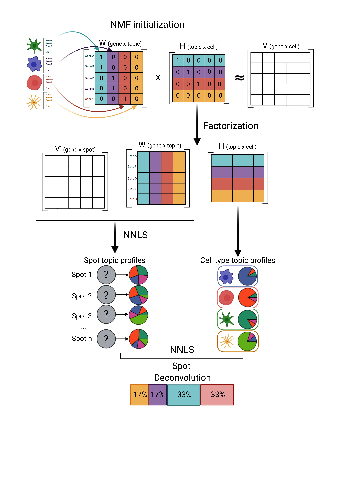

```{=html}
<style type="text/css">
.smaller {
  font-size: 10px
}
</style>
```

```{r echo = FALSE, message = FALSE, warning = FALSE}
library(BiocStyle)
```

For a more detailed explanation of `SPOTlight` consider looking at our
manuscript:\
\> Elosua-Bayes M, Nieto P, Mereu E, Gut I, Heyn H.\
SPOTlight: seeded NMF regression to deconvolute spatial transcriptomics spots\
with single-cell transcriptomes.\
*Nucleic Acids Res.* **2021;49(9):e50**. doi: [10.1093](10.1093/nar/gkab043)

# Load packages {.unnumbered}

```{r load-libs, message = FALSE,  warning = FALSE}
library(ggplot2)
library(SPOTlight)
library(SingleCellExperiment)
library(SpatialExperiment)
library(scater)
library(scran)
```

# Introduction

## What is SPOTlight?

`SPOTlight`is a tool that enables the deconvolution of cell types and cell type
proportions present within each capture location comprising mixtures of cells.
Originally developed for 10X's Visium - spatial transcriptomics - technology, it
can be used for all technologies returning mixtures of cells.

`SPOTlight` is based on learning topic profile signatures, by means of an NMFreg
model, for each cell type and finding which combination of cell types fits best
the spot we want to deconvolute. Find below a graphical abstract visually
summarizing the key steps.


## Starting point

The minimal unit of data required to run `SPOTlight` are:\
- ST (sparse) matrix with the expression, raw or normalized, where rows = genes
and columns = capture locations.\
- Single Cell (sparse) matrix with the expression, raw or normalized, where rows
= genes and columns = cells.\
- Vector indicating the cell identity for each column in the Single Cell
expression matrix.\

Data inputs can also be objects of class `r Biocpkg("SpatialExperiment")` (SE),
`r Biocpkg("SingleCellExperiment")` (SCE) or `r CRANpkg("Seurat")` objects from
which the minimal data will be extracted.

# Getting started

## Data description

For this vignette, we will use a SE put out by *10X Genomics* containing a
Visium kidney slide. The raw data can be accessed
[here](https://support.10xgenomics.com/spatial-gene-expression/datasets/1.1.0/V1_Mouse_Kidney).

SCE data comes from the [*The Tabula Muris
Consortium*](https://www.nature.com/articles/s41586-020-2496-1) which contains
\>350,000 cells from from male and female mice belonging to six age groups,
ranging from 1 to 30 months. From this dataset we will only load the kidney
subset to map it to the Visium slide.

## Loading the data

Both datasets are available through Biocondcutor's `ExperimentHub` and can be
loaded into R as follows:

```{r eh, message = FALSE}
library(ExperimentHub)

# initialize a Hub instance which stores a complete set of recordd
eh <- ExperimentHub()

# retrieve any records that match our keyword(s) of interest
query(eh, "Tabula Muris Senis droplet Kidney")
query(eh, "MouseKidneyCoronal")
```

Load the spatial data

```{r load-sp}
library(TENxVisiumData)
spe <- MouseKidneyCoronal()
# Change ensemblid to symbol
rownames(spe) <- rowData(spe)$symbol
```

Load the single cell data. Since we see that the data comes from the 
[Tabula Muris Sensis](https://www.nature.com/articles/s41586-020-2496-1) 
dataset we can directly load the SCE object as follows:

```{r load-sc}
library(TabulaMurisSenisData)
sce <- TabulaMurisSenisDroplet(tissues = "Kidney")$Kidney
```

Quick data exploration

```{r explo}
table(colData(sce)$age, colData(sce)$free_annotation)
```

We see how there is a good representation of all the cell types across ages
except at 24m. In order to reduce the potential noise introduced by age and
batch effects we are going to select cells all coming from the same age.

```{r sub-18m}
# Keep cells from 18m mice
sce <- subset(sce, , age == "18m")
# Keep cells with clear cell type annotations
sce <- subset(sce, , ! free_annotation %in% c("nan", "CD45"))
```

# Workflow

## Preprocessing

If the dataset is very large we want to downsample it to train the model, both
in of number of cells and number of genes. To do this, we want to keep a
representative amount of cells per cluster and the most biologically relevant
genes.

In the paper we show how downsampling the number of cells per cell identity to
\~100 doesn't affect the performance of the model. Including \>100 cells per
cell identity provides marginal improvement while greatly increasing
computational time and resources. Furthermore, restricting the gene set to the
marker genes for each cell type along with up to 3.000 highly variable genes
further optimizes performance and computational resources. You can find a more
detailed explanation in the original
[paper](https://academic.oup.com/nar/article/49/9/e50/6129341).

### Feature selection

Our first step is to get the marker genes for each cell type. We follow the
Normalization procedure as described in
[OSCA](http://bioconductor.org/books/3.14/OSCA.basic/normalization.html). We
first carry out library size normalization to correct for cell-specific biases:

```{r size-factor}
lib_sce <- librarySizeFactors(sce)
sizeFactors(sce) <- lib_sce
```

Once we have the size factor for each cell we scale and log transform the data
to get get normalized expression values for each cell.

```{r lognorm}
sce <- logNormCounts(sce)
```

### Variance modelling
We aim to identify highly variable genes that drive biological heterogeneity. 
By feeding these genes to the model we improve the resolution of the biological structure and reduce the technical noise
```{r variance}
dec <- modelGeneVar(sce)
plot(dec$mean, dec$total, xlab = "Mean log-expression", ylab = "Variance")
curve(metadata(dec)$trend(x), col = "blue", add = TRUE)

# Get the top 3000 genes.
hvg <- getTopHVGs(dec, n = 3000)
```

Next we obtain the marker genes for each cell identity. You can use whichever
method you want as long as it returns a weight indicating the importance of that
gene for that cell type. Examples can be `avgLogFC`, `AUC`, `pct.expressed`,
`p-value`...

```{r mgs}
colLabels(sce) <- colData(sce)$free_annotation

# Get vector  indicating which genes are neither ribosomal or mitochondrial
genes <- ! base::grepl(
  x = rownames(sce),
  pattern = "^Rp[l|s]|Mt")

# Compute marker genes
mgs <- scoreMarkers(sce, colLabels(sce), subset.row = genes)
```

Then we want to keep only those genes that are relevant for each cell identity

```{r mgs-df}
mgs_ls <- lapply(names(mgs), \(i){
  x <- mgs[[i]]
  # Filter and keep relevant marker genes, those with AUC > 0.8
  x <- x[x$mean.AUC > 0.8, ]
  # Sort the genes from highest to lowest weight
  x <- x[order(x$mean.AUC, decreasing = TRUE), ]
  # Add gene and cluster id to the dataframe
  x$gene <- rownames(x)
  x$cluster <- i
  data.frame(x)
})

mgs_df <- dplyr::bind_rows(mgs_ls)
```

### Cell Downsampling

Next you randomly select up to 100 cells/cell identity If a cell type is
comprised of \<100 cells than all the cells will be used. If we have very
biologically different cell identities (B cells vs T cells vs Macrophages vs
Epithelial) we can use fewer cells since their transcriptional profiles will be
very different. In cases when we have more transcriptionally similar cell
identities we need to increase our N to capture the biological heterogeneity
between them.

In our experience we have found that for this step it is better to select the
cells from each cell type from the same batch if you have a joint dataset from
multiple runs. This will ensure that the model removes as much signal from the
batch as possible and actually learns the biological signal.

For the purpose of this vignette and to speed up the analysis we are going to
use 20 cells per cell identity

```{r downsample}
n_cell <- 20
sce_ls <- split(colData(sce), sce$free_annotation)
id_keep <- lapply(sce_ls, function(.) {
  sample(
    x = rownames(.),
    size = ifelse(n_cell > nrow(.), nrow(.), n_cell),
    replace = FALSE)
  })

sce <- sce[, unlist(id_keep)]
```

## Deconvolution

You are now set to run `SPOTlight` to deconvolute the spots!

Briefly here is how it works: \

1. NMF is used to factorize a matrix into two lower dimensionality matrices
without negative elements. We first have an initial matrix V (SCE count matrix),
which is factored into W and H. Unit variance normalization by gene is performed
in V and in order to standardize discretized gene expression levels,
‘counts-umi’. Factorization is then carried out using the non-smooth NMF method,
implemented in the R package NMF `r CRANpkg("NMF")` (14). This method is
intended to return sparser results during the factorization in W and H, thus 
promoting cell-type-specific topic profile and reducing overfitting during 
training. Before running factorization, we initialize each topic, column, 
of W with the unique marker genes for each cell type with weights. In turn, each
topic of H in SPOTlight is initialized with the corresponding belongance of each
cell for each topic, 1 or 0. This way, we seed the model with prior information,
thus guiding it towards a biologically relevant result. This initialization also
aims at reducing variability and improving the consistency between runs. \

2. NNLS regression is used to map each capture location's transcriptome in V’
(SE count matrix) to H’ using W as the basis. We obtain a topic profile
distribution over each capture location which we can use to determine its
composition. \

3. we obtain Q, cell-type specific topic profiles, from H. We select all cells 
from the same cell type and compute the median of each topic for a consensus 
cell-type-specific topic signature. We then use NNLS to find the weights of each
cell type that best fit H’ minimizing the residuals.

You can visualize the above explanation in the following workflow scheme:



```{r}
res <- SPOTlight(
    x = as.matrix(counts(sce)),
    y = as.matrix(counts(spe)),
    groups = as.character(sce$free_annotation),
    mgs = mgs_df,
    hvg = hvg,
    weight_id = "mean.AUC",
    group_id = "cluster",
    gene_id = "gene")
```

Extract data from SPOTlight
```{r}
# saveRDS(object = res, file = "inst/extdata/res.rds")
# Extract deconvolution matrix
head(mat <- res[[1]])
```

# Visualization
In the next section we show how to visualize the data and interpret
`SPOTlight`'s performance.

## Topic profiles

We first take a look at the Topic profiles. By setting facet = FALSE we want to
evaluate how specific each topic signature is for each cell identity.
Ideally each cell identity will have a unique topic profile associated to it as 
seen below.
```{r plotTopicProfiles1, fig.width=9, fig.height=9}
mod <- res[[3]]

plotTopicProfiles(
  x = mod,
  y = as.character(sce$free_annotation),
  facet = FALSE,
  min_prop = 0.01,
  ncol = 1)
```

Next we also want to ensure that all the cells from the same cell identity share 
a similar topic profile since this will mean that `SPOTlight` has learnt a
consistent signature for all the cells from the same cell identity.
```{r plotTopicProfiles2, fig.width=9, fig.height=9}
plotTopicProfiles(
  x = mod,
  y = as.character(sce$free_annotation),
  facet = TRUE,
  min_prop = 0.01,
  ncol = 4)
```

Lastly we can take a look at which genes the model learned for each topic.
Higher values indicate that the gene is more relevant for that topic. 
In the below table we can see how the top genes for topic 1 are characteristic
for B cells (i.e. *Cd79a*, *Cd79b*, *Ms4a1*...).
```{r basis-dt}
library(DT)
library(NMF)
sign <- basis(mod)
colnames(sign) <- paste0("Topic",1:ncol(sign))
datatable(sign, fillContainer = TRUE, filter = "top")
```

## Spatial Correlation Matrix

See [here](http://www.sthda.com/english/wiki/ggcorrplot-visualization-of-a-correlation-matrix-using-ggplot2) 
for additional graphical parameters.
```{r plotCorrelationMatrix, fig.width=9, fig.height=9}
plotCorrelationMatrix(x = mat)
```

## Co-localization

Now that we know which cell types are found within each spot we can make a graph
representing spatial interactions where cell types will have stronger edges
between them the more often we find them within the same spot.

See [here](https://www.r-graph-gallery.com/network.html) for additional
graphical parameters.

```{r plotInteractions, fig.width=9, fig.height=9}
plotInteractions(mat, "heatmap")
plotInteractions(mat, "network")
```

## Scatterpie

We can also visualize the cell type proportions as sections of a piechart for 
each spot. You can modify the colors as you would a standard `r CRANpkg("ggplot2")`.
```{r Scatterpie, fig.width=12, fig.height=9}
ct <- colnames(mat)
mat[mat < 0.1] <- 0
library(colorBlindness)
paletteMartin
# Define the number of colors you want
mycolors <- colorRampPalette(paletteMartin)(length(ct))
names(mycolors) <- ct

plotSpatialScatterpie(
    x = spe,
    y = mat,
    cell_types = colnames(y),
    img = FALSE,
    scatterpie_alpha = 1,
    pie_scale = 0.4) +
    scale_fill_manual(
        values = mycolors,
        breaks = names(mycolors))
```

## Residuals
Lastly we can also take a look at how well the model predicted the proportions
for each spot. We do this by looking at the residuals of the sum of squares for
each spot which indicates the amount of biological signal not explained by the model.
```{r}
?merge
meta <- merge(colData(spe), data.frame(res[[2]]), by = 0)
row.names(meta) <- meta$Row.names
colData(spe) <- meta

```


# Session information

```{r session-info}
sessionInfo()
```

# References
